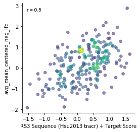

# Rule Set 3
> Python package to predict the activity of CRISPR sgRNA sequences using Rule Set 3


## Install

`pip install git+ssh://git@github.com/gpp-rnd/rs3.git`

## Quick Start

### Sequence based model

Import packages

```
from rs3.seq import predict_seq
```

Create a list of context sequences you want to predict

```
context_seqs = ['GACGAAAGCGACAACGCGTTCATCCGGGCA', 'AGAAAACACTAGCATCCCCACCCGCGGACT']
```

You can predict on-target scores for sequences using the `predict_seq` function, specifying either
[Hsu2013](https://www.nature.com/articles/nbt.2647) or
[Chen2013](https://www.sciencedirect.com/science/article/pii/S0092867413015316?via%3Dihub)
as the tracrRNA to score with

```
predict_seq(context_seqs, sequence_tracr='Hsu2013')
```


    array([-0.86673522,  1.09560723])


### Target and sequence scores

Using the `predict` function we can calculate both target scores and sequence scores. Target-based scores use
information such as amino acid sequence and whether the sgRNA targets in a protein domain.

```
import pandas as pd
from rs3.predict import predict
import gpplot
import seaborn as sns
import matplotlib.pyplot as plt
```

We'll use a list of ~250 sgRNA from the GeckoV2 library as an example dataset

```
design_df = pd.read_table('test_data/sgrna-designs.txt')
design_df
```


<div>
<style scoped>
    .dataframe tbody tr th:only-of-type {
        vertical-align: middle;
    }

    .dataframe tbody tr th {
        vertical-align: top;
    }

    .dataframe thead th {
        text-align: right;
    }
</style>
<table border="1" class="dataframe">
  <thead>
    <tr style="text-align: right;">
      <th></th>
      <th>Input</th>
      <th>Quota</th>
      <th>Target Taxon</th>
      <th>Target Gene ID</th>
      <th>Target Gene Symbol</th>
      <th>Target Transcript</th>
      <th>Target Reference Coords</th>
      <th>Target Alias</th>
      <th>CRISPR Mechanism</th>
      <th>Target Domain</th>
      <th>...</th>
      <th>On-Target Rank Weight</th>
      <th>Off-Target Rank Weight</th>
      <th>Combined Rank</th>
      <th>Preselected As</th>
      <th>Matching Active Arrayed Oligos</th>
      <th>Matching Arrayed Constructs</th>
      <th>Pools Containing Matching Construct</th>
      <th>Pick Order</th>
      <th>Picking Round</th>
      <th>Picking Notes</th>
    </tr>
  </thead>
  <tbody>
    <tr>
      <th>0</th>
      <td>PSMB7</td>
      <td>2</td>
      <td>9606</td>
      <td>ENSG00000136930</td>
      <td>PSMB7</td>
      <td>ENST00000259457.8</td>
      <td>NaN</td>
      <td>NaN</td>
      <td>CRISPRko</td>
      <td>CDS</td>
      <td>...</td>
      <td>1.0</td>
      <td>1.0</td>
      <td>7</td>
      <td>GCAGATACAAGAGCAACTGA</td>
      <td>NaN</td>
      <td>BRDN0004619103</td>
      <td>NaN</td>
      <td>1</td>
      <td>0</td>
      <td>Preselected</td>
    </tr>
    <tr>
      <th>1</th>
      <td>PSMB7</td>
      <td>2</td>
      <td>9606</td>
      <td>ENSG00000136930</td>
      <td>PSMB7</td>
      <td>ENST00000259457.8</td>
      <td>NaN</td>
      <td>NaN</td>
      <td>CRISPRko</td>
      <td>CDS</td>
      <td>...</td>
      <td>1.0</td>
      <td>1.0</td>
      <td>48</td>
      <td>AAAACTGGCACGACCATCGC</td>
      <td>NaN</td>
      <td>NaN</td>
      <td>NaN</td>
      <td>2</td>
      <td>0</td>
      <td>Preselected</td>
    </tr>
    <tr>
      <th>2</th>
      <td>PRC1</td>
      <td>2</td>
      <td>9606</td>
      <td>ENSG00000198901</td>
      <td>PRC1</td>
      <td>ENST00000394249.8</td>
      <td>NaN</td>
      <td>NaN</td>
      <td>CRISPRko</td>
      <td>CDS</td>
      <td>...</td>
      <td>1.0</td>
      <td>1.0</td>
      <td>7</td>
      <td>AAAAGATTTGCGCACCCAAG</td>
      <td>NaN</td>
      <td>NaN</td>
      <td>NaN</td>
      <td>1</td>
      <td>0</td>
      <td>Preselected</td>
    </tr>
    <tr>
      <th>3</th>
      <td>PRC1</td>
      <td>2</td>
      <td>9606</td>
      <td>ENSG00000198901</td>
      <td>PRC1</td>
      <td>ENST00000394249.8</td>
      <td>NaN</td>
      <td>NaN</td>
      <td>CRISPRko</td>
      <td>CDS</td>
      <td>...</td>
      <td>1.0</td>
      <td>1.0</td>
      <td>8</td>
      <td>CTTTGACCCAGACATAATGG</td>
      <td>NaN</td>
      <td>NaN</td>
      <td>NaN</td>
      <td>2</td>
      <td>0</td>
      <td>Preselected</td>
    </tr>
    <tr>
      <th>4</th>
      <td>TOP1</td>
      <td>2</td>
      <td>9606</td>
      <td>ENSG00000198900</td>
      <td>TOP1</td>
      <td>ENST00000361337.3</td>
      <td>NaN</td>
      <td>NaN</td>
      <td>CRISPRko</td>
      <td>CDS</td>
      <td>...</td>
      <td>1.0</td>
      <td>1.0</td>
      <td>1</td>
      <td>NaN</td>
      <td>NaN</td>
      <td>BRDN0001486452</td>
      <td>NaN</td>
      <td>2</td>
      <td>1</td>
      <td>NaN</td>
    </tr>
    <tr>
      <th>...</th>
      <td>...</td>
      <td>...</td>
      <td>...</td>
      <td>...</td>
      <td>...</td>
      <td>...</td>
      <td>...</td>
      <td>...</td>
      <td>...</td>
      <td>...</td>
      <td>...</td>
      <td>...</td>
      <td>...</td>
      <td>...</td>
      <td>...</td>
      <td>...</td>
      <td>...</td>
      <td>...</td>
      <td>...</td>
      <td>...</td>
      <td>...</td>
    </tr>
    <tr>
      <th>395</th>
      <td>RFC5</td>
      <td>2</td>
      <td>9606</td>
      <td>ENSG00000111445</td>
      <td>RFC5</td>
      <td>ENST00000454402.7</td>
      <td>NaN</td>
      <td>NaN</td>
      <td>CRISPRko</td>
      <td>CDS</td>
      <td>...</td>
      <td>1.0</td>
      <td>1.0</td>
      <td>23</td>
      <td>TTTATATAGCTGTTTCGCAC</td>
      <td>NaN</td>
      <td>NaN</td>
      <td>NaN</td>
      <td>1</td>
      <td>0</td>
      <td>Preselected</td>
    </tr>
    <tr>
      <th>396</th>
      <td>NXT1</td>
      <td>2</td>
      <td>9606</td>
      <td>ENSG00000132661</td>
      <td>NXT1</td>
      <td>ENST00000254998.3</td>
      <td>NaN</td>
      <td>NaN</td>
      <td>CRISPRko</td>
      <td>CDS</td>
      <td>...</td>
      <td>1.0</td>
      <td>1.0</td>
      <td>3</td>
      <td>NaN</td>
      <td>NaN</td>
      <td>BRDN0002419367</td>
      <td>NaN</td>
      <td>2</td>
      <td>1</td>
      <td>NaN</td>
    </tr>
    <tr>
      <th>397</th>
      <td>NXT1</td>
      <td>2</td>
      <td>9606</td>
      <td>ENSG00000132661</td>
      <td>NXT1</td>
      <td>ENST00000254998.3</td>
      <td>NaN</td>
      <td>NaN</td>
      <td>CRISPRko</td>
      <td>CDS</td>
      <td>...</td>
      <td>1.0</td>
      <td>1.0</td>
      <td>31</td>
      <td>TTTGCTGTCCCGCCTGTACA</td>
      <td>NaN</td>
      <td>NaN</td>
      <td>NaN</td>
      <td>1</td>
      <td>0</td>
      <td>Preselected</td>
    </tr>
    <tr>
      <th>398</th>
      <td>NOL10</td>
      <td>2</td>
      <td>9606</td>
      <td>ENSG00000115761</td>
      <td>NOL10</td>
      <td>ENST00000381685.10</td>
      <td>NaN</td>
      <td>NaN</td>
      <td>CRISPRko</td>
      <td>CDS</td>
      <td>...</td>
      <td>1.0</td>
      <td>1.0</td>
      <td>3</td>
      <td>NaN</td>
      <td>NaN</td>
      <td>NaN</td>
      <td>NaN</td>
      <td>2</td>
      <td>1</td>
      <td>NaN</td>
    </tr>
    <tr>
      <th>399</th>
      <td>NOL10</td>
      <td>2</td>
      <td>9606</td>
      <td>ENSG00000115761</td>
      <td>NOL10</td>
      <td>ENST00000381685.10</td>
      <td>NaN</td>
      <td>NaN</td>
      <td>CRISPRko</td>
      <td>CDS</td>
      <td>...</td>
      <td>1.0</td>
      <td>1.0</td>
      <td>14</td>
      <td>TTTGTCTGATGACTACTCAA</td>
      <td>NaN</td>
      <td>NaN</td>
      <td>NaN</td>
      <td>1</td>
      <td>0</td>
      <td>Preselected</td>
    </tr>
  </tbody>
</table>
<p>400 rows × 60 columns</p>
</div>


```
gecko_activity = pd.read_csv('test_data/Aguirre2017_activity.csv')
gecko_activity
```


<div>
<style scoped>
    .dataframe tbody tr th:only-of-type {
        vertical-align: middle;
    }

    .dataframe tbody tr th {
        vertical-align: top;
    }

    .dataframe thead th {
        text-align: right;
    }
</style>
<table border="1" class="dataframe">
  <thead>
    <tr style="text-align: right;">
      <th></th>
      <th>sgRNA Sequence</th>
      <th>sgRNA Context Sequence</th>
      <th>Target Gene Symbol</th>
      <th>Target Cut %</th>
      <th>avg_mean_centered_neg_lfc</th>
    </tr>
  </thead>
  <tbody>
    <tr>
      <th>0</th>
      <td>AAAAAACTTACCCCTTTGAC</td>
      <td>AAAAAAAAAACTTACCCCTTTGACTGGCCA</td>
      <td>CPSF6</td>
      <td>22.2</td>
      <td>-1.139819</td>
    </tr>
    <tr>
      <th>1</th>
      <td>AAAAACATTATCATTGAGCC</td>
      <td>TGGCAAAAACATTATCATTGAGCCTGGATT</td>
      <td>SKA3</td>
      <td>62.3</td>
      <td>-0.793055</td>
    </tr>
    <tr>
      <th>2</th>
      <td>AAAAAGAGATTGTCAAATCA</td>
      <td>TATGAAAAAGAGATTGTCAAATCAAGGTAG</td>
      <td>AQR</td>
      <td>3.8</td>
      <td>0.946453</td>
    </tr>
    <tr>
      <th>3</th>
      <td>AAAAAGCATCTCTAGAAATA</td>
      <td>TTCAAAAAAGCATCTCTAGAAATATGGTCC</td>
      <td>ZNHIT6</td>
      <td>61.7</td>
      <td>-0.429590</td>
    </tr>
    <tr>
      <th>4</th>
      <td>AAAAAGCGAGATACCCGAAA</td>
      <td>AAAAAAAAAGCGAGATACCCGAAAAGGCAG</td>
      <td>ABCF1</td>
      <td>9.4</td>
      <td>0.734196</td>
    </tr>
    <tr>
      <th>...</th>
      <td>...</td>
      <td>...</td>
      <td>...</td>
      <td>...</td>
      <td>...</td>
    </tr>
    <tr>
      <th>8654</th>
      <td>TTTGTGGCAGCGAATCATAA</td>
      <td>TGTCTTTGTGGCAGCGAATCATAATGGTTC</td>
      <td>UMPS</td>
      <td>43.8</td>
      <td>-0.927345</td>
    </tr>
    <tr>
      <th>8655</th>
      <td>TTTGTTAATATCTGCTGAAC</td>
      <td>TGAATTTGTTAATATCTGCTGAACAGGAGT</td>
      <td>GTF2A1</td>
      <td>40.3</td>
      <td>-0.382060</td>
    </tr>
    <tr>
      <th>8656</th>
      <td>TTTGTTAGGATGTGCATTCC</td>
      <td>TTTCTTTGTTAGGATGTGCATTCCAGGTAC</td>
      <td>NAT10</td>
      <td>16.4</td>
      <td>-0.927645</td>
    </tr>
    <tr>
      <th>8657</th>
      <td>TTTGTTAGGTCATCGTATTG</td>
      <td>GGTTTTTGTTAGGTCATCGTATTGAGGAAG</td>
      <td>RPL4</td>
      <td>33.5</td>
      <td>-1.425502</td>
    </tr>
    <tr>
      <th>8658</th>
      <td>TTTGTTCCTTAGTTGCTGAC</td>
      <td>TACTTTTGTTCCTTAGTTGCTGACAGGTCC</td>
      <td>MRPL47</td>
      <td>34.8</td>
      <td>-1.268444</td>
    </tr>
  </tbody>
</table>
<p>8659 rows × 5 columns</p>
</div>


By listing both tracrRNA `tracr=['Hsu2013', 'Chen2013']` and setting `target=True`, we calculate
5 unique scores: one sequence score for each tracr, the target score, and the sequence scores plus the target score.

```
scored_designs = predict(design_df, tracr=['Hsu2013', 'Chen2013'], target=True,
                         n_jobs=2)
scored_designs
```

    Getting amino acid sequences


    100%|██████████| 4/4 [00:00<00:00, 94.47it/s]


    Getting protein domains


    100%|██████████| 200/200 [00:30<00:00,  6.50it/s]
    /Users/pdeweird/opt/anaconda3/envs/rs3/lib/python3.8/site-packages/sklearn/base.py:310: UserWarning: Trying to unpickle estimator SimpleImputer from version 1.0.dev0 when using version 0.24.2. This might lead to breaking code or invalid results. Use at your own risk.
      warnings.warn(
    /Users/pdeweird/opt/anaconda3/envs/rs3/lib/python3.8/site-packages/sklearn/base.py:310: UserWarning: Trying to unpickle estimator Pipeline from version 1.0.dev0 when using version 0.24.2. This might lead to breaking code or invalid results. Use at your own risk.
      warnings.warn(


<div>
<style scoped>
    .dataframe tbody tr th:only-of-type {
        vertical-align: middle;
    }

    .dataframe tbody tr th {
        vertical-align: top;
    }

    .dataframe thead th {
        text-align: right;
    }
</style>
<table border="1" class="dataframe">
  <thead>
    <tr style="text-align: right;">
      <th></th>
      <th>Input</th>
      <th>Quota</th>
      <th>Target Taxon</th>
      <th>Target Gene ID</th>
      <th>Target Gene Symbol</th>
      <th>Target Transcript</th>
      <th>Target Reference Coords</th>
      <th>Target Alias</th>
      <th>CRISPR Mechanism</th>
      <th>Target Domain</th>
      <th>...</th>
      <th>Pools Containing Matching Construct</th>
      <th>Pick Order</th>
      <th>Picking Round</th>
      <th>Picking Notes</th>
      <th>RS3 Sequence Score (Hsu2013 tracr)</th>
      <th>RS3 Sequence Score (Chen2013 tracr)</th>
      <th>Transcript Base</th>
      <th>RS3 Target Score</th>
      <th>RS3 Sequence (Hsu2013 tracr) + Target Score</th>
      <th>RS3 Sequence (Chen2013 tracr) + Target Score</th>
    </tr>
  </thead>
  <tbody>
    <tr>
      <th>0</th>
      <td>PSMB7</td>
      <td>2</td>
      <td>9606</td>
      <td>ENSG00000136930</td>
      <td>PSMB7</td>
      <td>ENST00000259457.8</td>
      <td>NaN</td>
      <td>NaN</td>
      <td>CRISPRko</td>
      <td>CDS</td>
      <td>...</td>
      <td>NaN</td>
      <td>1</td>
      <td>0</td>
      <td>Preselected</td>
      <td>0.750904</td>
      <td>0.512534</td>
      <td>ENST00000259457</td>
      <td>0.273974</td>
      <td>1.024878</td>
      <td>0.786508</td>
    </tr>
    <tr>
      <th>1</th>
      <td>PSMB7</td>
      <td>2</td>
      <td>9606</td>
      <td>ENSG00000136930</td>
      <td>PSMB7</td>
      <td>ENST00000259457.8</td>
      <td>NaN</td>
      <td>NaN</td>
      <td>CRISPRko</td>
      <td>CDS</td>
      <td>...</td>
      <td>NaN</td>
      <td>2</td>
      <td>0</td>
      <td>Preselected</td>
      <td>-0.218514</td>
      <td>-0.095684</td>
      <td>ENST00000259457</td>
      <td>-0.010152</td>
      <td>-0.228667</td>
      <td>-0.105837</td>
    </tr>
    <tr>
      <th>2</th>
      <td>PRC1</td>
      <td>2</td>
      <td>9606</td>
      <td>ENSG00000198901</td>
      <td>PRC1</td>
      <td>ENST00000394249.8</td>
      <td>NaN</td>
      <td>NaN</td>
      <td>CRISPRko</td>
      <td>CDS</td>
      <td>...</td>
      <td>NaN</td>
      <td>1</td>
      <td>0</td>
      <td>Preselected</td>
      <td>-0.126708</td>
      <td>-0.307830</td>
      <td>ENST00000394249</td>
      <td>-0.018259</td>
      <td>-0.144967</td>
      <td>-0.326089</td>
    </tr>
    <tr>
      <th>3</th>
      <td>PRC1</td>
      <td>2</td>
      <td>9606</td>
      <td>ENSG00000198901</td>
      <td>PRC1</td>
      <td>ENST00000394249.8</td>
      <td>NaN</td>
      <td>NaN</td>
      <td>CRISPRko</td>
      <td>CDS</td>
      <td>...</td>
      <td>NaN</td>
      <td>2</td>
      <td>0</td>
      <td>Preselected</td>
      <td>0.690050</td>
      <td>0.390095</td>
      <td>ENST00000394249</td>
      <td>-0.089659</td>
      <td>0.600392</td>
      <td>0.300436</td>
    </tr>
    <tr>
      <th>4</th>
      <td>TOP1</td>
      <td>2</td>
      <td>9606</td>
      <td>ENSG00000198900</td>
      <td>TOP1</td>
      <td>ENST00000361337.3</td>
      <td>NaN</td>
      <td>NaN</td>
      <td>CRISPRko</td>
      <td>CDS</td>
      <td>...</td>
      <td>NaN</td>
      <td>2</td>
      <td>1</td>
      <td>NaN</td>
      <td>0.451508</td>
      <td>-0.169016</td>
      <td>ENST00000361337</td>
      <td>-0.018748</td>
      <td>0.432760</td>
      <td>-0.187764</td>
    </tr>
    <tr>
      <th>...</th>
      <td>...</td>
      <td>...</td>
      <td>...</td>
      <td>...</td>
      <td>...</td>
      <td>...</td>
      <td>...</td>
      <td>...</td>
      <td>...</td>
      <td>...</td>
      <td>...</td>
      <td>...</td>
      <td>...</td>
      <td>...</td>
      <td>...</td>
      <td>...</td>
      <td>...</td>
      <td>...</td>
      <td>...</td>
      <td>...</td>
      <td>...</td>
    </tr>
    <tr>
      <th>395</th>
      <td>RFC5</td>
      <td>2</td>
      <td>9606</td>
      <td>ENSG00000111445</td>
      <td>RFC5</td>
      <td>ENST00000454402.7</td>
      <td>NaN</td>
      <td>NaN</td>
      <td>CRISPRko</td>
      <td>CDS</td>
      <td>...</td>
      <td>NaN</td>
      <td>1</td>
      <td>0</td>
      <td>Preselected</td>
      <td>-0.220600</td>
      <td>-0.022154</td>
      <td>ENST00000454402</td>
      <td>0.102902</td>
      <td>-0.117698</td>
      <td>0.080747</td>
    </tr>
    <tr>
      <th>396</th>
      <td>NXT1</td>
      <td>2</td>
      <td>9606</td>
      <td>ENSG00000132661</td>
      <td>NXT1</td>
      <td>ENST00000254998.3</td>
      <td>NaN</td>
      <td>NaN</td>
      <td>CRISPRko</td>
      <td>CDS</td>
      <td>...</td>
      <td>NaN</td>
      <td>2</td>
      <td>1</td>
      <td>NaN</td>
      <td>0.621609</td>
      <td>0.539656</td>
      <td>ENST00000254998</td>
      <td>0.220856</td>
      <td>0.842465</td>
      <td>0.760513</td>
    </tr>
    <tr>
      <th>397</th>
      <td>NXT1</td>
      <td>2</td>
      <td>9606</td>
      <td>ENSG00000132661</td>
      <td>NXT1</td>
      <td>ENST00000254998.3</td>
      <td>NaN</td>
      <td>NaN</td>
      <td>CRISPRko</td>
      <td>CDS</td>
      <td>...</td>
      <td>NaN</td>
      <td>1</td>
      <td>0</td>
      <td>Preselected</td>
      <td>0.119830</td>
      <td>0.012744</td>
      <td>ENST00000254998</td>
      <td>0.146767</td>
      <td>0.266597</td>
      <td>0.159511</td>
    </tr>
    <tr>
      <th>398</th>
      <td>NOL10</td>
      <td>2</td>
      <td>9606</td>
      <td>ENSG00000115761</td>
      <td>NOL10</td>
      <td>ENST00000381685.10</td>
      <td>NaN</td>
      <td>NaN</td>
      <td>CRISPRko</td>
      <td>CDS</td>
      <td>...</td>
      <td>NaN</td>
      <td>2</td>
      <td>1</td>
      <td>NaN</td>
      <td>0.798633</td>
      <td>0.646323</td>
      <td>ENST00000381685</td>
      <td>-0.039771</td>
      <td>0.758861</td>
      <td>0.606552</td>
    </tr>
    <tr>
      <th>399</th>
      <td>NOL10</td>
      <td>2</td>
      <td>9606</td>
      <td>ENSG00000115761</td>
      <td>NOL10</td>
      <td>ENST00000381685.10</td>
      <td>NaN</td>
      <td>NaN</td>
      <td>CRISPRko</td>
      <td>CDS</td>
      <td>...</td>
      <td>NaN</td>
      <td>1</td>
      <td>0</td>
      <td>Preselected</td>
      <td>0.283254</td>
      <td>0.264148</td>
      <td>ENST00000381685</td>
      <td>0.015462</td>
      <td>0.298716</td>
      <td>0.279611</td>
    </tr>
  </tbody>
</table>
<p>400 rows × 66 columns</p>
</div>


```
gecko_activity_scores = (gecko_activity.merge(scored_designs,
                                              how='inner',
                                              on=['sgRNA Sequence', 'sgRNA Context Sequence',
                                                  'Target Gene Symbol', 'Target Cut %']))
gecko_activity_scores
```


<div>
<style scoped>
    .dataframe tbody tr th:only-of-type {
        vertical-align: middle;
    }

    .dataframe tbody tr th {
        vertical-align: top;
    }

    .dataframe thead th {
        text-align: right;
    }
</style>
<table border="1" class="dataframe">
  <thead>
    <tr style="text-align: right;">
      <th></th>
      <th>sgRNA Sequence</th>
      <th>sgRNA Context Sequence</th>
      <th>Target Gene Symbol</th>
      <th>Target Cut %</th>
      <th>avg_mean_centered_neg_lfc</th>
      <th>Input</th>
      <th>Quota</th>
      <th>Target Taxon</th>
      <th>Target Gene ID</th>
      <th>Target Transcript</th>
      <th>...</th>
      <th>Pools Containing Matching Construct</th>
      <th>Pick Order</th>
      <th>Picking Round</th>
      <th>Picking Notes</th>
      <th>RS3 Sequence Score (Hsu2013 tracr)</th>
      <th>RS3 Sequence Score (Chen2013 tracr)</th>
      <th>Transcript Base</th>
      <th>RS3 Target Score</th>
      <th>RS3 Sequence (Hsu2013 tracr) + Target Score</th>
      <th>RS3 Sequence (Chen2013 tracr) + Target Score</th>
    </tr>
  </thead>
  <tbody>
    <tr>
      <th>0</th>
      <td>AAAACTGGCACGACCATCGC</td>
      <td>CCGGAAAACTGGCACGACCATCGCTGGGGT</td>
      <td>PSMB7</td>
      <td>16.4</td>
      <td>-1.052943</td>
      <td>PSMB7</td>
      <td>2</td>
      <td>9606</td>
      <td>ENSG00000136930</td>
      <td>ENST00000259457.8</td>
      <td>...</td>
      <td>NaN</td>
      <td>2</td>
      <td>0</td>
      <td>Preselected</td>
      <td>-0.218514</td>
      <td>-0.095684</td>
      <td>ENST00000259457</td>
      <td>-0.010152</td>
      <td>-0.228667</td>
      <td>-0.105837</td>
    </tr>
    <tr>
      <th>1</th>
      <td>AAAAGATTTGCGCACCCAAG</td>
      <td>TAGAAAAAGATTTGCGCACCCAAGTGGAAT</td>
      <td>PRC1</td>
      <td>17.0</td>
      <td>0.028674</td>
      <td>PRC1</td>
      <td>2</td>
      <td>9606</td>
      <td>ENSG00000198901</td>
      <td>ENST00000394249.8</td>
      <td>...</td>
      <td>NaN</td>
      <td>1</td>
      <td>0</td>
      <td>Preselected</td>
      <td>-0.126708</td>
      <td>-0.307830</td>
      <td>ENST00000394249</td>
      <td>-0.018259</td>
      <td>-0.144967</td>
      <td>-0.326089</td>
    </tr>
    <tr>
      <th>2</th>
      <td>AAAAGTCCAAGCATAGCAAC</td>
      <td>CGGGAAAAGTCCAAGCATAGCAACAGGTAA</td>
      <td>TOP1</td>
      <td>6.5</td>
      <td>0.195309</td>
      <td>TOP1</td>
      <td>2</td>
      <td>9606</td>
      <td>ENSG00000198900</td>
      <td>ENST00000361337.3</td>
      <td>...</td>
      <td>NaN</td>
      <td>1</td>
      <td>0</td>
      <td>Preselected</td>
      <td>-0.356580</td>
      <td>-0.082514</td>
      <td>ENST00000361337</td>
      <td>-0.418276</td>
      <td>-0.774856</td>
      <td>-0.500790</td>
    </tr>
    <tr>
      <th>3</th>
      <td>AAAGAAGCCTCAACTTCGTC</td>
      <td>AGCGAAAGAAGCCTCAACTTCGTCTGGAGA</td>
      <td>CENPW</td>
      <td>37.5</td>
      <td>-1.338209</td>
      <td>CENPW</td>
      <td>2</td>
      <td>9606</td>
      <td>ENSG00000203760</td>
      <td>ENST00000368328.5</td>
      <td>...</td>
      <td>NaN</td>
      <td>2</td>
      <td>0</td>
      <td>Preselected</td>
      <td>-0.663540</td>
      <td>-0.303324</td>
      <td>ENST00000368328</td>
      <td>0.274739</td>
      <td>-0.388801</td>
      <td>-0.028585</td>
    </tr>
    <tr>
      <th>4</th>
      <td>AAAGTGTGCTTTGTTGGAGA</td>
      <td>TACTAAAGTGTGCTTTGTTGGAGATGGCTT</td>
      <td>NSA2</td>
      <td>60.0</td>
      <td>-0.175219</td>
      <td>NSA2</td>
      <td>2</td>
      <td>9606</td>
      <td>ENSG00000164346</td>
      <td>ENST00000610426.5</td>
      <td>...</td>
      <td>NaN</td>
      <td>2</td>
      <td>0</td>
      <td>Preselected</td>
      <td>-0.413636</td>
      <td>-0.585179</td>
      <td>ENST00000610426</td>
      <td>-0.072158</td>
      <td>-0.485794</td>
      <td>-0.657337</td>
    </tr>
    <tr>
      <th>...</th>
      <td>...</td>
      <td>...</td>
      <td>...</td>
      <td>...</td>
      <td>...</td>
      <td>...</td>
      <td>...</td>
      <td>...</td>
      <td>...</td>
      <td>...</td>
      <td>...</td>
      <td>...</td>
      <td>...</td>
      <td>...</td>
      <td>...</td>
      <td>...</td>
      <td>...</td>
      <td>...</td>
      <td>...</td>
      <td>...</td>
      <td>...</td>
    </tr>
    <tr>
      <th>247</th>
      <td>TTTAGCCGGATGCGCAGTGA</td>
      <td>CTCTTTTAGCCGGATGCGCAGTGATGGTTT</td>
      <td>NKAPD1</td>
      <td>20.6</td>
      <td>0.627322</td>
      <td>NKAPD1</td>
      <td>2</td>
      <td>9606</td>
      <td>ENSG00000150776</td>
      <td>ENST00000393047.8</td>
      <td>...</td>
      <td>CP1718</td>
      <td>1</td>
      <td>0</td>
      <td>Preselected</td>
      <td>0.298329</td>
      <td>0.274344</td>
      <td>ENST00000393047</td>
      <td>-0.201158</td>
      <td>0.097171</td>
      <td>0.073187</td>
    </tr>
    <tr>
      <th>248</th>
      <td>TTTATATAGCTGTTTCGCAC</td>
      <td>TGTCTTTATATAGCTGTTTCGCACAGGCTA</td>
      <td>RFC5</td>
      <td>21.5</td>
      <td>-0.957190</td>
      <td>RFC5</td>
      <td>2</td>
      <td>9606</td>
      <td>ENSG00000111445</td>
      <td>ENST00000454402.7</td>
      <td>...</td>
      <td>NaN</td>
      <td>1</td>
      <td>0</td>
      <td>Preselected</td>
      <td>-0.220600</td>
      <td>-0.022154</td>
      <td>ENST00000454402</td>
      <td>0.102902</td>
      <td>-0.117698</td>
      <td>0.080747</td>
    </tr>
    <tr>
      <th>249</th>
      <td>TTTGCTGTCCCGCCTGTACA</td>
      <td>GGCGTTTGCTGTCCCGCCTGTACATGGGCA</td>
      <td>NXT1</td>
      <td>27.2</td>
      <td>0.176827</td>
      <td>NXT1</td>
      <td>2</td>
      <td>9606</td>
      <td>ENSG00000132661</td>
      <td>ENST00000254998.3</td>
      <td>...</td>
      <td>NaN</td>
      <td>1</td>
      <td>0</td>
      <td>Preselected</td>
      <td>0.119830</td>
      <td>0.012744</td>
      <td>ENST00000254998</td>
      <td>0.146767</td>
      <td>0.266597</td>
      <td>0.159511</td>
    </tr>
    <tr>
      <th>250</th>
      <td>TTTGTCTGATGACTACTCAA</td>
      <td>AAATTTTGTCTGATGACTACTCAAAGGTAT</td>
      <td>NOL10</td>
      <td>15.6</td>
      <td>-0.043965</td>
      <td>NOL10</td>
      <td>2</td>
      <td>9606</td>
      <td>ENSG00000115761</td>
      <td>ENST00000381685.10</td>
      <td>...</td>
      <td>NaN</td>
      <td>1</td>
      <td>0</td>
      <td>Preselected</td>
      <td>0.283254</td>
      <td>0.264148</td>
      <td>ENST00000381685</td>
      <td>0.015462</td>
      <td>0.298716</td>
      <td>0.279611</td>
    </tr>
    <tr>
      <th>251</th>
      <td>TTTGTTAGGTCATCGTATTG</td>
      <td>GGTTTTTGTTAGGTCATCGTATTGAGGAAG</td>
      <td>RPL4</td>
      <td>33.5</td>
      <td>-1.425502</td>
      <td>RPL4</td>
      <td>2</td>
      <td>9606</td>
      <td>ENSG00000174444</td>
      <td>ENST00000307961.11</td>
      <td>...</td>
      <td>CP1718</td>
      <td>2</td>
      <td>1</td>
      <td>NaN</td>
      <td>-0.636302</td>
      <td>-0.575100</td>
      <td>ENST00000307961</td>
      <td>0.021391</td>
      <td>-0.614912</td>
      <td>-0.553709</td>
    </tr>
  </tbody>
</table>
<p>252 rows × 67 columns</p>
</div>


Since Gecko was screened with the tracrRNA from Hsu et al. 2013, we'll use this as our predictor

```
plt.subplots(figsize=(4,4))
gpplot.point_densityplot(gecko_activity_scores, y='avg_mean_centered_neg_lfc',
                         x='RS3 Sequence (Hsu2013 tracr) + Target Score')
gpplot.add_correlation(gecko_activity_scores, y='avg_mean_centered_neg_lfc',
                       x='RS3 Sequence (Hsu2013 tracr) + Target Score')
sns.despine()
```




