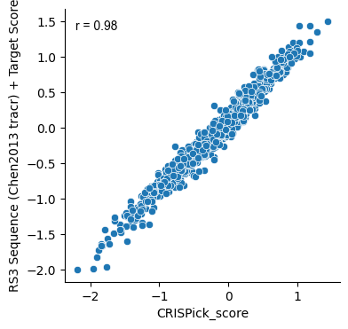

# Rule Set 3
> Python package to predict the activity of CRISPR sgRNA sequences using Rule Set 3


## Install

You can install the latest release of rs3 from pypi using

`pip install rs3`

For mac users you may also have to brew install the OpenMP library

`brew install libomp`

or install lightgbm without Openmp

`pip install lightgbm --install-option=--nomp`

See the [LightGBM documentation](https://github.com/microsoft/LightGBM/tree/master/python-package)
for more information

## Documentation

You can see the complete documentation for Rule Set 3 [here](https://gpp-rnd.github.io/rs3/).

## Quick Start

### Sequence based model

To calculate Rule Set 3 (sequence) scores, import the predict_seq function from the seq module.

```
from rs3.seq import predict_seq
```

You can store the 30mer context sequences you want to predict as a list.

```
context_seqs = ['GACGAAAGCGACAACGCGTTCATCCGGGCA', 'AGAAAACACTAGCATCCCCACCCGCGGACT']
```

You can specify the
[Hsu2013](https://www.nature.com/articles/nbt.2647) or
[Chen2013](https://www.sciencedirect.com/science/article/pii/S0092867413015316?via%3Dihub)
as the tracrRNA to score with.
We generally find any tracrRNA that does not have a T in the fifth position is better predicted with the Chen2013 input.

```
predict_seq(context_seqs, sequence_tracr='Hsu2013')
```

    Calculating sequence-based features


    100%|██████████| 2/2 [00:00<00:00, 352.28it/s]


    array([-0.90030944,  1.11451622])


### Target based model

To get target scores, which use features at the endogenous target site to make predictions,
you must build or load feature matrices for the amino acid sequences, conservation scores, and protein domains.

As an example, we'll calculate target scores for 250 sgRNAs in the GeckoV2 library.

```
import pandas as pd
from rs3.predicttarg import predict_target
from rs3.targetfeat import (add_target_columns,
                            get_aa_subseq_df,
                            get_protein_domain_features,
                            get_conservation_features)
```

```
design_df = pd.read_table('test_data/sgrna-designs.txt')
design_df.head()
```


<div>
<style scoped>
    .dataframe tbody tr th:only-of-type {
        vertical-align: middle;
    }

    .dataframe tbody tr th {
        vertical-align: top;
    }

    .dataframe thead th {
        text-align: right;
    }
</style>
<table border="1" class="dataframe">
  <thead>
    <tr style="text-align: right;">
      <th></th>
      <th>Input</th>
      <th>Quota</th>
      <th>Target Taxon</th>
      <th>Target Gene ID</th>
      <th>Target Gene Symbol</th>
      <th>Target Transcript</th>
      <th>Target Reference Coords</th>
      <th>Target Alias</th>
      <th>CRISPR Mechanism</th>
      <th>Target Domain</th>
      <th>...</th>
      <th>On-Target Rank Weight</th>
      <th>Off-Target Rank Weight</th>
      <th>Combined Rank</th>
      <th>Preselected As</th>
      <th>Matching Active Arrayed Oligos</th>
      <th>Matching Arrayed Constructs</th>
      <th>Pools Containing Matching Construct</th>
      <th>Pick Order</th>
      <th>Picking Round</th>
      <th>Picking Notes</th>
    </tr>
  </thead>
  <tbody>
    <tr>
      <th>0</th>
      <td>PSMB7</td>
      <td>2</td>
      <td>9606</td>
      <td>ENSG00000136930</td>
      <td>PSMB7</td>
      <td>ENST00000259457.8</td>
      <td>NaN</td>
      <td>NaN</td>
      <td>CRISPRko</td>
      <td>CDS</td>
      <td>...</td>
      <td>1.0</td>
      <td>1.0</td>
      <td>7</td>
      <td>GCAGATACAAGAGCAACTGA</td>
      <td>NaN</td>
      <td>BRDN0004619103</td>
      <td>NaN</td>
      <td>1</td>
      <td>0</td>
      <td>Preselected</td>
    </tr>
    <tr>
      <th>1</th>
      <td>PSMB7</td>
      <td>2</td>
      <td>9606</td>
      <td>ENSG00000136930</td>
      <td>PSMB7</td>
      <td>ENST00000259457.8</td>
      <td>NaN</td>
      <td>NaN</td>
      <td>CRISPRko</td>
      <td>CDS</td>
      <td>...</td>
      <td>1.0</td>
      <td>1.0</td>
      <td>48</td>
      <td>AAAACTGGCACGACCATCGC</td>
      <td>NaN</td>
      <td>NaN</td>
      <td>NaN</td>
      <td>2</td>
      <td>0</td>
      <td>Preselected</td>
    </tr>
    <tr>
      <th>2</th>
      <td>PRC1</td>
      <td>2</td>
      <td>9606</td>
      <td>ENSG00000198901</td>
      <td>PRC1</td>
      <td>ENST00000394249.8</td>
      <td>NaN</td>
      <td>NaN</td>
      <td>CRISPRko</td>
      <td>CDS</td>
      <td>...</td>
      <td>1.0</td>
      <td>1.0</td>
      <td>7</td>
      <td>AAAAGATTTGCGCACCCAAG</td>
      <td>NaN</td>
      <td>NaN</td>
      <td>NaN</td>
      <td>1</td>
      <td>0</td>
      <td>Preselected</td>
    </tr>
    <tr>
      <th>3</th>
      <td>PRC1</td>
      <td>2</td>
      <td>9606</td>
      <td>ENSG00000198901</td>
      <td>PRC1</td>
      <td>ENST00000394249.8</td>
      <td>NaN</td>
      <td>NaN</td>
      <td>CRISPRko</td>
      <td>CDS</td>
      <td>...</td>
      <td>1.0</td>
      <td>1.0</td>
      <td>8</td>
      <td>CTTTGACCCAGACATAATGG</td>
      <td>NaN</td>
      <td>NaN</td>
      <td>NaN</td>
      <td>2</td>
      <td>0</td>
      <td>Preselected</td>
    </tr>
    <tr>
      <th>4</th>
      <td>TOP1</td>
      <td>2</td>
      <td>9606</td>
      <td>ENSG00000198900</td>
      <td>TOP1</td>
      <td>ENST00000361337.3</td>
      <td>NaN</td>
      <td>NaN</td>
      <td>CRISPRko</td>
      <td>CDS</td>
      <td>...</td>
      <td>1.0</td>
      <td>1.0</td>
      <td>1</td>
      <td>NaN</td>
      <td>NaN</td>
      <td>BRDN0001486452</td>
      <td>NaN</td>
      <td>2</td>
      <td>1</td>
      <td>NaN</td>
    </tr>
  </tbody>
</table>
<p>5 rows × 60 columns</p>
</div>


Throughout the analysis we will be using a core set of ID columns to merge the feature matrices. These ID columns
should uniquely identify an sgRNA and its target site.

```
id_cols = ['sgRNA Context Sequence', 'Target Cut Length', 'Target Transcript', 'Orientation']
```

#### Amino acid sequence input

To calculate the amino acid sequence matrix, you must first load the complete sequence from ensembl using the
`build_transcript_aa_seq_df`. See the documentation for the `predicttarg` module for an example of how to
use this function.

In this example we will use amino acid sequences that have been precalculated using the `write_transcript_data`
function in the `targetdata` module. Check out the documentation for this module for more information on
how to use this function.

We use pyarrow to read the written transcript data.
The stored transcripts are indexed by their Ensembl ID without the version number identifier.
To get this shortened version of the Ensembl ID use the `add_target_columns` function from the `targetfeat` module.
This function adds the 'Transcript Base' column as well as a column indicating the amino acid index ('AA Index')
of the cut site. The 'AA Index' column will be used for merging with the amino acid translations.

```
design_targ_df = add_target_columns(design_df)
design_targ_df.head()
```


<div>
<style scoped>
    .dataframe tbody tr th:only-of-type {
        vertical-align: middle;
    }

    .dataframe tbody tr th {
        vertical-align: top;
    }

    .dataframe thead th {
        text-align: right;
    }
</style>
<table border="1" class="dataframe">
  <thead>
    <tr style="text-align: right;">
      <th></th>
      <th>Input</th>
      <th>Quota</th>
      <th>Target Taxon</th>
      <th>Target Gene ID</th>
      <th>Target Gene Symbol</th>
      <th>Target Transcript</th>
      <th>Target Reference Coords</th>
      <th>Target Alias</th>
      <th>CRISPR Mechanism</th>
      <th>Target Domain</th>
      <th>...</th>
      <th>Combined Rank</th>
      <th>Preselected As</th>
      <th>Matching Active Arrayed Oligos</th>
      <th>Matching Arrayed Constructs</th>
      <th>Pools Containing Matching Construct</th>
      <th>Pick Order</th>
      <th>Picking Round</th>
      <th>Picking Notes</th>
      <th>AA Index</th>
      <th>Transcript Base</th>
    </tr>
  </thead>
  <tbody>
    <tr>
      <th>0</th>
      <td>PSMB7</td>
      <td>2</td>
      <td>9606</td>
      <td>ENSG00000136930</td>
      <td>PSMB7</td>
      <td>ENST00000259457.8</td>
      <td>NaN</td>
      <td>NaN</td>
      <td>CRISPRko</td>
      <td>CDS</td>
      <td>...</td>
      <td>7</td>
      <td>GCAGATACAAGAGCAACTGA</td>
      <td>NaN</td>
      <td>BRDN0004619103</td>
      <td>NaN</td>
      <td>1</td>
      <td>0</td>
      <td>Preselected</td>
      <td>64</td>
      <td>ENST00000259457</td>
    </tr>
    <tr>
      <th>1</th>
      <td>PSMB7</td>
      <td>2</td>
      <td>9606</td>
      <td>ENSG00000136930</td>
      <td>PSMB7</td>
      <td>ENST00000259457.8</td>
      <td>NaN</td>
      <td>NaN</td>
      <td>CRISPRko</td>
      <td>CDS</td>
      <td>...</td>
      <td>48</td>
      <td>AAAACTGGCACGACCATCGC</td>
      <td>NaN</td>
      <td>NaN</td>
      <td>NaN</td>
      <td>2</td>
      <td>0</td>
      <td>Preselected</td>
      <td>46</td>
      <td>ENST00000259457</td>
    </tr>
    <tr>
      <th>2</th>
      <td>PRC1</td>
      <td>2</td>
      <td>9606</td>
      <td>ENSG00000198901</td>
      <td>PRC1</td>
      <td>ENST00000394249.8</td>
      <td>NaN</td>
      <td>NaN</td>
      <td>CRISPRko</td>
      <td>CDS</td>
      <td>...</td>
      <td>7</td>
      <td>AAAAGATTTGCGCACCCAAG</td>
      <td>NaN</td>
      <td>NaN</td>
      <td>NaN</td>
      <td>1</td>
      <td>0</td>
      <td>Preselected</td>
      <td>106</td>
      <td>ENST00000394249</td>
    </tr>
    <tr>
      <th>3</th>
      <td>PRC1</td>
      <td>2</td>
      <td>9606</td>
      <td>ENSG00000198901</td>
      <td>PRC1</td>
      <td>ENST00000394249.8</td>
      <td>NaN</td>
      <td>NaN</td>
      <td>CRISPRko</td>
      <td>CDS</td>
      <td>...</td>
      <td>8</td>
      <td>CTTTGACCCAGACATAATGG</td>
      <td>NaN</td>
      <td>NaN</td>
      <td>NaN</td>
      <td>2</td>
      <td>0</td>
      <td>Preselected</td>
      <td>263</td>
      <td>ENST00000394249</td>
    </tr>
    <tr>
      <th>4</th>
      <td>TOP1</td>
      <td>2</td>
      <td>9606</td>
      <td>ENSG00000198900</td>
      <td>TOP1</td>
      <td>ENST00000361337.3</td>
      <td>NaN</td>
      <td>NaN</td>
      <td>CRISPRko</td>
      <td>CDS</td>
      <td>...</td>
      <td>1</td>
      <td>NaN</td>
      <td>NaN</td>
      <td>BRDN0001486452</td>
      <td>NaN</td>
      <td>2</td>
      <td>1</td>
      <td>NaN</td>
      <td>140</td>
      <td>ENST00000361337</td>
    </tr>
  </tbody>
</table>
<p>5 rows × 62 columns</p>
</div>


```
transcript_bases = design_targ_df['Transcript Base'].unique()
transcript_bases[0:5]
```


    array(['ENST00000259457', 'ENST00000394249', 'ENST00000361337',
           'ENST00000368328', 'ENST00000610426'], dtype=object)


```
aa_seq_df = pd.read_parquet('test_data/target_data/aa_seqs.pq', engine='pyarrow',
                            filters=[[('Transcript Base', 'in', transcript_bases)]])
aa_seq_df.head()
```


<div>
<style scoped>
    .dataframe tbody tr th:only-of-type {
        vertical-align: middle;
    }

    .dataframe tbody tr th {
        vertical-align: top;
    }

    .dataframe thead th {
        text-align: right;
    }
</style>
<table border="1" class="dataframe">
  <thead>
    <tr style="text-align: right;">
      <th></th>
      <th>Target Transcript</th>
      <th>Target Total Length</th>
      <th>Transcript Base</th>
      <th>version</th>
      <th>seq</th>
      <th>molecule</th>
      <th>desc</th>
      <th>id</th>
      <th>AA len</th>
    </tr>
  </thead>
  <tbody>
    <tr>
      <th>0</th>
      <td>ENST00000259457.8</td>
      <td>834</td>
      <td>ENST00000259457</td>
      <td>3</td>
      <td>MAAVSVYAPPVGGFSFDNCRRNAVLEADFAKRGYKLPKVRKTGTTI...</td>
      <td>protein</td>
      <td>None</td>
      <td>ENSP00000259457</td>
      <td>277</td>
    </tr>
    <tr>
      <th>1</th>
      <td>ENST00000394249.8</td>
      <td>1863</td>
      <td>ENST00000394249</td>
      <td>3</td>
      <td>MRRSEVLAEESIVCLQKALNHLREIWELIGIPEDQRLQRTEVVKKH...</td>
      <td>protein</td>
      <td>None</td>
      <td>ENSP00000377793</td>
      <td>620</td>
    </tr>
    <tr>
      <th>2</th>
      <td>ENST00000361337.3</td>
      <td>2298</td>
      <td>ENST00000361337</td>
      <td>2</td>
      <td>MSGDHLHNDSQIEADFRLNDSHKHKDKHKDREHRHKEHKKEKDREK...</td>
      <td>protein</td>
      <td>None</td>
      <td>ENSP00000354522</td>
      <td>765</td>
    </tr>
    <tr>
      <th>3</th>
      <td>ENST00000368328.5</td>
      <td>267</td>
      <td>ENST00000368328</td>
      <td>4</td>
      <td>MALSTIVSQRKQIKRKAPRGFLKRVFKRKKPQLRLEKSGDLLVHLN...</td>
      <td>protein</td>
      <td>None</td>
      <td>ENSP00000357311</td>
      <td>88</td>
    </tr>
    <tr>
      <th>4</th>
      <td>ENST00000610426.5</td>
      <td>783</td>
      <td>ENST00000610426</td>
      <td>1</td>
      <td>MPQNEYIELHRKRYGYRLDYHEKKRKKESREAHERSKKAKKMIGLK...</td>
      <td>protein</td>
      <td>None</td>
      <td>ENSP00000483484</td>
      <td>260</td>
    </tr>
  </tbody>
</table>
</div>


From the complete transcript translations, we extract an amino acid subsequence as input to our model. The subsequence
is centered around the amino acid encoded by the nucleotide preceding the cut site in the direction of transcription.
This is the nucleotide that corresponds to the 'Target Cut Length' in a CRISPick design file.
We take 16 amino acids on either side of the cut site for a total sequence length of 33.

The `get_aa_subseq_df` from the `targetfeat` module will calculate these subsequences
from the complete amino acid sequences.

```
aa_subseq_df = get_aa_subseq_df(sg_designs=design_targ_df, aa_seq_df=aa_seq_df, width=16,
                                id_cols=id_cols)
aa_subseq_df.head()
```


<div>
<style scoped>
    .dataframe tbody tr th:only-of-type {
        vertical-align: middle;
    }

    .dataframe tbody tr th {
        vertical-align: top;
    }

    .dataframe thead th {
        text-align: right;
    }
</style>
<table border="1" class="dataframe">
  <thead>
    <tr style="text-align: right;">
      <th></th>
      <th>Target Transcript</th>
      <th>Target Total Length</th>
      <th>Transcript Base</th>
      <th>version</th>
      <th>seq</th>
      <th>molecule</th>
      <th>desc</th>
      <th>id</th>
      <th>AA len</th>
      <th>Target Cut Length</th>
      <th>AA Index</th>
      <th>Orientation</th>
      <th>sgRNA Context Sequence</th>
      <th>extended_seq</th>
      <th>AA 0-Indexed</th>
      <th>AA 0-Indexed padded</th>
      <th>seq_start</th>
      <th>seq_end</th>
      <th>AA Subsequence</th>
    </tr>
  </thead>
  <tbody>
    <tr>
      <th>0</th>
      <td>ENST00000259457.8</td>
      <td>834</td>
      <td>ENST00000259457</td>
      <td>3</td>
      <td>MAAVSVYAPPVGGFSFDNCRRNAVLEADFAKRGYKLPKVRKTGTTI...</td>
      <td>protein</td>
      <td>None</td>
      <td>ENSP00000259457</td>
      <td>277</td>
      <td>191</td>
      <td>64</td>
      <td>sense</td>
      <td>TGGAGCAGATACAAGAGCAACTGAAGGGAT</td>
      <td>-----------------MAAVSVYAPPVGGFSFDNCRRNAVLEADF...</td>
      <td>63</td>
      <td>80</td>
      <td>64</td>
      <td>96</td>
      <td>GVVYKDGIVLGADTRATEGMVVADKNCSKIHFI</td>
    </tr>
    <tr>
      <th>1</th>
      <td>ENST00000259457.8</td>
      <td>834</td>
      <td>ENST00000259457</td>
      <td>3</td>
      <td>MAAVSVYAPPVGGFSFDNCRRNAVLEADFAKRGYKLPKVRKTGTTI...</td>
      <td>protein</td>
      <td>None</td>
      <td>ENSP00000259457</td>
      <td>277</td>
      <td>137</td>
      <td>46</td>
      <td>sense</td>
      <td>CCGGAAAACTGGCACGACCATCGCTGGGGT</td>
      <td>-----------------MAAVSVYAPPVGGFSFDNCRRNAVLEADF...</td>
      <td>45</td>
      <td>62</td>
      <td>46</td>
      <td>78</td>
      <td>AKRGYKLPKVRKTGTTIAGVVYKDGIVLGADTR</td>
    </tr>
    <tr>
      <th>2</th>
      <td>ENST00000394249.8</td>
      <td>1863</td>
      <td>ENST00000394249</td>
      <td>3</td>
      <td>MRRSEVLAEESIVCLQKALNHLREIWELIGIPEDQRLQRTEVVKKH...</td>
      <td>protein</td>
      <td>None</td>
      <td>ENSP00000377793</td>
      <td>620</td>
      <td>316</td>
      <td>106</td>
      <td>sense</td>
      <td>TAGAAAAAGATTTGCGCACCCAAGTGGAAT</td>
      <td>-----------------MRRSEVLAEESIVCLQKALNHLREIWELI...</td>
      <td>105</td>
      <td>122</td>
      <td>106</td>
      <td>138</td>
      <td>EEGETTILQLEKDLRTQVELMRKQKKERKQELK</td>
    </tr>
    <tr>
      <th>3</th>
      <td>ENST00000394249.8</td>
      <td>1863</td>
      <td>ENST00000394249</td>
      <td>3</td>
      <td>MRRSEVLAEESIVCLQKALNHLREIWELIGIPEDQRLQRTEVVKKH...</td>
      <td>protein</td>
      <td>None</td>
      <td>ENSP00000377793</td>
      <td>620</td>
      <td>787</td>
      <td>263</td>
      <td>antisense</td>
      <td>TGGCCTTTGACCCAGACATAATGGTGGCCA</td>
      <td>-----------------MRRSEVLAEESIVCLQKALNHLREIWELI...</td>
      <td>262</td>
      <td>279</td>
      <td>263</td>
      <td>295</td>
      <td>WDRLQIPEEEREAVATIMSGSKAKVRKALQLEV</td>
    </tr>
    <tr>
      <th>4</th>
      <td>ENST00000361337.3</td>
      <td>2298</td>
      <td>ENST00000361337</td>
      <td>2</td>
      <td>MSGDHLHNDSQIEADFRLNDSHKHKDKHKDREHRHKEHKKEKDREK...</td>
      <td>protein</td>
      <td>None</td>
      <td>ENSP00000354522</td>
      <td>765</td>
      <td>420</td>
      <td>140</td>
      <td>antisense</td>
      <td>AAATACTCACTCATCCTCATCTCGAGGTCT</td>
      <td>-----------------MSGDHLHNDSQIEADFRLNDSHKHKDKHK...</td>
      <td>139</td>
      <td>156</td>
      <td>140</td>
      <td>172</td>
      <td>GYFVPPKEDIKPLKRPRDEDDADYKPKKIKTED</td>
    </tr>
  </tbody>
</table>
</div>


#### Lite Scores

You now have all the information you need to calculate "lite" Target Scores, which are less data intensive than complete
target scores, with the `predict_target` function from the `predicttarg` module.

```
lite_predictions = predict_target(design_df=design_df,
                                  aa_subseq_df=aa_subseq_df)
design_df['Target Score Lite'] = lite_predictions
design_df.head()
```

    /Users/peterdeweirdt/miniforge3/envs/test_rs3_v7/lib/python3.9/site-packages/sklearn/base.py:329: UserWarning: Trying to unpickle estimator SimpleImputer from version 1.0.dev0 when using version 1.0.2. This might lead to breaking code or invalid results. Use at your own risk. For more info please refer to:
    https://scikit-learn.org/stable/modules/model_persistence.html#security-maintainability-limitations
      warnings.warn(
    /Users/peterdeweirdt/miniforge3/envs/test_rs3_v7/lib/python3.9/site-packages/sklearn/base.py:329: UserWarning: Trying to unpickle estimator Pipeline from version 1.0.dev0 when using version 1.0.2. This might lead to breaking code or invalid results. Use at your own risk. For more info please refer to:
    https://scikit-learn.org/stable/modules/model_persistence.html#security-maintainability-limitations
      warnings.warn(
    /Users/peterdeweirdt/miniforge3/envs/test_rs3_v7/lib/python3.9/site-packages/sklearn/base.py:443: UserWarning: X has feature names, but SimpleImputer was fitted without feature names
      warnings.warn(


<div>
<style scoped>
    .dataframe tbody tr th:only-of-type {
        vertical-align: middle;
    }

    .dataframe tbody tr th {
        vertical-align: top;
    }

    .dataframe thead th {
        text-align: right;
    }
</style>
<table border="1" class="dataframe">
  <thead>
    <tr style="text-align: right;">
      <th></th>
      <th>Input</th>
      <th>Quota</th>
      <th>Target Taxon</th>
      <th>Target Gene ID</th>
      <th>Target Gene Symbol</th>
      <th>Target Transcript</th>
      <th>Target Reference Coords</th>
      <th>Target Alias</th>
      <th>CRISPR Mechanism</th>
      <th>Target Domain</th>
      <th>...</th>
      <th>Off-Target Rank Weight</th>
      <th>Combined Rank</th>
      <th>Preselected As</th>
      <th>Matching Active Arrayed Oligos</th>
      <th>Matching Arrayed Constructs</th>
      <th>Pools Containing Matching Construct</th>
      <th>Pick Order</th>
      <th>Picking Round</th>
      <th>Picking Notes</th>
      <th>Target Score Lite</th>
    </tr>
  </thead>
  <tbody>
    <tr>
      <th>0</th>
      <td>PSMB7</td>
      <td>2</td>
      <td>9606</td>
      <td>ENSG00000136930</td>
      <td>PSMB7</td>
      <td>ENST00000259457.8</td>
      <td>NaN</td>
      <td>NaN</td>
      <td>CRISPRko</td>
      <td>CDS</td>
      <td>...</td>
      <td>1.0</td>
      <td>7</td>
      <td>GCAGATACAAGAGCAACTGA</td>
      <td>NaN</td>
      <td>BRDN0004619103</td>
      <td>NaN</td>
      <td>1</td>
      <td>0</td>
      <td>Preselected</td>
      <td>-0.088666</td>
    </tr>
    <tr>
      <th>1</th>
      <td>PSMB7</td>
      <td>2</td>
      <td>9606</td>
      <td>ENSG00000136930</td>
      <td>PSMB7</td>
      <td>ENST00000259457.8</td>
      <td>NaN</td>
      <td>NaN</td>
      <td>CRISPRko</td>
      <td>CDS</td>
      <td>...</td>
      <td>1.0</td>
      <td>48</td>
      <td>AAAACTGGCACGACCATCGC</td>
      <td>NaN</td>
      <td>NaN</td>
      <td>NaN</td>
      <td>2</td>
      <td>0</td>
      <td>Preselected</td>
      <td>-0.013821</td>
    </tr>
    <tr>
      <th>2</th>
      <td>PRC1</td>
      <td>2</td>
      <td>9606</td>
      <td>ENSG00000198901</td>
      <td>PRC1</td>
      <td>ENST00000394249.8</td>
      <td>NaN</td>
      <td>NaN</td>
      <td>CRISPRko</td>
      <td>CDS</td>
      <td>...</td>
      <td>1.0</td>
      <td>7</td>
      <td>AAAAGATTTGCGCACCCAAG</td>
      <td>NaN</td>
      <td>NaN</td>
      <td>NaN</td>
      <td>1</td>
      <td>0</td>
      <td>Preselected</td>
      <td>0.103036</td>
    </tr>
    <tr>
      <th>3</th>
      <td>PRC1</td>
      <td>2</td>
      <td>9606</td>
      <td>ENSG00000198901</td>
      <td>PRC1</td>
      <td>ENST00000394249.8</td>
      <td>NaN</td>
      <td>NaN</td>
      <td>CRISPRko</td>
      <td>CDS</td>
      <td>...</td>
      <td>1.0</td>
      <td>8</td>
      <td>CTTTGACCCAGACATAATGG</td>
      <td>NaN</td>
      <td>NaN</td>
      <td>NaN</td>
      <td>2</td>
      <td>0</td>
      <td>Preselected</td>
      <td>0.160578</td>
    </tr>
    <tr>
      <th>4</th>
      <td>TOP1</td>
      <td>2</td>
      <td>9606</td>
      <td>ENSG00000198900</td>
      <td>TOP1</td>
      <td>ENST00000361337.3</td>
      <td>NaN</td>
      <td>NaN</td>
      <td>CRISPRko</td>
      <td>CDS</td>
      <td>...</td>
      <td>1.0</td>
      <td>1</td>
      <td>NaN</td>
      <td>NaN</td>
      <td>BRDN0001486452</td>
      <td>NaN</td>
      <td>2</td>
      <td>1</td>
      <td>NaN</td>
      <td>0.069597</td>
    </tr>
  </tbody>
</table>
<p>5 rows × 61 columns</p>
</div>


If you would like to calculate full target scores then follow the sections below.

#### Protein domain input

To calculate full target scores you will also need inputs for protein domains and conservation.

The protein domain input should have 16 binary columns for 16 different protein domain sources in addition to the
`id_cols`. The protein domain sources are 'Pfam', 'PANTHER', 'HAMAP', 'SuperFamily', 'TIGRfam', 'ncoils', 'Gene3D',
'Prosite_patterns', 'Seg', 'SignalP', 'TMHMM', 'MobiDBLite', 'PIRSF', 'PRINTS', 'Smart', 'Prosite_profiles'.
These columns should be kept in order when inputting for scoring.

In this example we will load the protein domain information from a parquet file, which was written
using `write_transcript_data` function in the `targetdata` module. You can also query transcript data on the fly,
by using the `build_translation_overlap_df` function. See the documentation for the `predicttarg` module for more
information on how to do this.

```
domain_df = pd.read_parquet('test_data/target_data/protein_domains.pq', engine='pyarrow',
                            filters=[[('Transcript Base', 'in', transcript_bases)]])
domain_df.head()
```


<div>
<style scoped>
    .dataframe tbody tr th:only-of-type {
        vertical-align: middle;
    }

    .dataframe tbody tr th {
        vertical-align: top;
    }

    .dataframe thead th {
        text-align: right;
    }
</style>
<table border="1" class="dataframe">
  <thead>
    <tr style="text-align: right;">
      <th></th>
      <th>type</th>
      <th>cigar_string</th>
      <th>id</th>
      <th>hit_end</th>
      <th>feature_type</th>
      <th>description</th>
      <th>seq_region_name</th>
      <th>end</th>
      <th>hit_start</th>
      <th>translation_id</th>
      <th>interpro</th>
      <th>hseqname</th>
      <th>Transcript Base</th>
      <th>align_type</th>
      <th>start</th>
    </tr>
  </thead>
  <tbody>
    <tr>
      <th>0</th>
      <td>Pfam</td>
      <td></td>
      <td>PF12465</td>
      <td>36</td>
      <td>protein_feature</td>
      <td>Proteasome beta subunit, C-terminal</td>
      <td>ENSP00000259457</td>
      <td>271</td>
      <td>1</td>
      <td>976188</td>
      <td>IPR024689</td>
      <td>PF12465</td>
      <td>ENST00000259457</td>
      <td>None</td>
      <td>235</td>
    </tr>
    <tr>
      <th>1</th>
      <td>Pfam</td>
      <td></td>
      <td>PF00227</td>
      <td>190</td>
      <td>protein_feature</td>
      <td>Proteasome, subunit alpha/beta</td>
      <td>ENSP00000259457</td>
      <td>221</td>
      <td>2</td>
      <td>976188</td>
      <td>IPR001353</td>
      <td>PF00227</td>
      <td>ENST00000259457</td>
      <td>None</td>
      <td>41</td>
    </tr>
    <tr>
      <th>2</th>
      <td>PRINTS</td>
      <td></td>
      <td>PR00141</td>
      <td>0</td>
      <td>protein_feature</td>
      <td>Peptidase T1A, proteasome beta-subunit</td>
      <td>ENSP00000259457</td>
      <td>66</td>
      <td>0</td>
      <td>976188</td>
      <td>IPR000243</td>
      <td>PR00141</td>
      <td>ENST00000259457</td>
      <td>None</td>
      <td>51</td>
    </tr>
    <tr>
      <th>3</th>
      <td>PRINTS</td>
      <td></td>
      <td>PR00141</td>
      <td>0</td>
      <td>protein_feature</td>
      <td>Peptidase T1A, proteasome beta-subunit</td>
      <td>ENSP00000259457</td>
      <td>182</td>
      <td>0</td>
      <td>976188</td>
      <td>IPR000243</td>
      <td>PR00141</td>
      <td>ENST00000259457</td>
      <td>None</td>
      <td>171</td>
    </tr>
    <tr>
      <th>4</th>
      <td>PRINTS</td>
      <td></td>
      <td>PR00141</td>
      <td>0</td>
      <td>protein_feature</td>
      <td>Peptidase T1A, proteasome beta-subunit</td>
      <td>ENSP00000259457</td>
      <td>193</td>
      <td>0</td>
      <td>976188</td>
      <td>IPR000243</td>
      <td>PR00141</td>
      <td>ENST00000259457</td>
      <td>None</td>
      <td>182</td>
    </tr>
  </tbody>
</table>
</div>


Now to transform the `domain_df` into a wide form for model input, we use the `get_protein_domain_features` function
from the `targetfeat` module.

```
domain_feature_df = get_protein_domain_features(design_targ_df, domain_df, id_cols=id_cols)
domain_feature_df.head()
```


<div>
<style scoped>
    .dataframe tbody tr th:only-of-type {
        vertical-align: middle;
    }

    .dataframe tbody tr th {
        vertical-align: top;
    }

    .dataframe thead th {
        text-align: right;
    }
</style>
<table border="1" class="dataframe">
  <thead>
    <tr style="text-align: right;">
      <th></th>
      <th>sgRNA Context Sequence</th>
      <th>Target Cut Length</th>
      <th>Target Transcript</th>
      <th>Orientation</th>
      <th>Pfam</th>
      <th>PANTHER</th>
      <th>HAMAP</th>
      <th>SuperFamily</th>
      <th>TIGRfam</th>
      <th>ncoils</th>
      <th>Gene3D</th>
      <th>Prosite_patterns</th>
      <th>Seg</th>
      <th>SignalP</th>
      <th>TMHMM</th>
      <th>MobiDBLite</th>
      <th>PIRSF</th>
      <th>PRINTS</th>
      <th>Smart</th>
      <th>Prosite_profiles</th>
    </tr>
  </thead>
  <tbody>
    <tr>
      <th>0</th>
      <td>AAAAGAATGATGAAAAGACACCACAGGGAG</td>
      <td>244</td>
      <td>ENST00000610426.5</td>
      <td>sense</td>
      <td>1</td>
      <td>1</td>
      <td>0</td>
      <td>0</td>
      <td>0</td>
      <td>0</td>
      <td>0</td>
      <td>0</td>
      <td>0</td>
      <td>0</td>
      <td>0</td>
      <td>0</td>
      <td>0</td>
      <td>0</td>
      <td>0</td>
      <td>0</td>
    </tr>
    <tr>
      <th>1</th>
      <td>AAAAGAGCCATGAATCTAAACATCAGGAAT</td>
      <td>640</td>
      <td>ENST00000223073.6</td>
      <td>sense</td>
      <td>0</td>
      <td>1</td>
      <td>0</td>
      <td>0</td>
      <td>0</td>
      <td>1</td>
      <td>0</td>
      <td>0</td>
      <td>1</td>
      <td>0</td>
      <td>0</td>
      <td>1</td>
      <td>0</td>
      <td>0</td>
      <td>0</td>
      <td>0</td>
    </tr>
    <tr>
      <th>2</th>
      <td>AAAAGCGCCAAATGGCCCGAGAATTGGGAG</td>
      <td>709</td>
      <td>ENST00000331923.9</td>
      <td>sense</td>
      <td>0</td>
      <td>1</td>
      <td>0</td>
      <td>0</td>
      <td>0</td>
      <td>0</td>
      <td>0</td>
      <td>0</td>
      <td>0</td>
      <td>0</td>
      <td>0</td>
      <td>1</td>
      <td>0</td>
      <td>0</td>
      <td>0</td>
      <td>0</td>
    </tr>
    <tr>
      <th>3</th>
      <td>AAACAGAAAAAGTTAAAATCACCAAGGTGT</td>
      <td>496</td>
      <td>ENST00000283882.4</td>
      <td>sense</td>
      <td>0</td>
      <td>1</td>
      <td>0</td>
      <td>0</td>
      <td>0</td>
      <td>0</td>
      <td>0</td>
      <td>0</td>
      <td>0</td>
      <td>0</td>
      <td>0</td>
      <td>0</td>
      <td>0</td>
      <td>0</td>
      <td>0</td>
      <td>0</td>
    </tr>
    <tr>
      <th>4</th>
      <td>AAACAGATGGAAGATGCTTACCGGGGGACC</td>
      <td>132</td>
      <td>ENST00000393047.8</td>
      <td>sense</td>
      <td>0</td>
      <td>1</td>
      <td>0</td>
      <td>0</td>
      <td>0</td>
      <td>0</td>
      <td>0</td>
      <td>0</td>
      <td>0</td>
      <td>0</td>
      <td>0</td>
      <td>0</td>
      <td>0</td>
      <td>0</td>
      <td>0</td>
      <td>0</td>
    </tr>
  </tbody>
</table>
</div>


For input into the `predict_target` function, the `domain_feature_df` should have the `id_cols` as well as
columns for each of the 16 protein domain features.

#### Conservation input

Finally, for the full target model you need to calculate conservation features.
The conservation features represent conservation across evolutionary time at the sgRNA cut site and are quantified
using PhyloP scores. These scores are available for download by the UCSC genome browser
for [hg38](https://hgdownload.soe.ucsc.edu/goldenPath/hg38/database/) (phyloP100way),
and [mm39](https://hgdownload.soe.ucsc.edu/goldenPath/mm39/database/) (phyloP35way).

Within this package we query conservation scores using the UCSC genome browser's
[REST API](http://genome.ucsc.edu/goldenPath/help/api.html).
To get conservation scores, you can use the `build_conservation_df` function from the `targetdata` module.
Here we load conservation scores, which were written to parquet using the `write_conservation_data` function from the
`targetdata` module.

```
conservation_df = pd.read_parquet('test_data/target_data/conservation.pq', engine='pyarrow',
                                  filters=[[('Transcript Base', 'in', transcript_bases)]])
conservation_df.head()
```


<div>
<style scoped>
    .dataframe tbody tr th:only-of-type {
        vertical-align: middle;
    }

    .dataframe tbody tr th {
        vertical-align: top;
    }

    .dataframe thead th {
        text-align: right;
    }
</style>
<table border="1" class="dataframe">
  <thead>
    <tr style="text-align: right;">
      <th></th>
      <th>exon_id</th>
      <th>genomic position</th>
      <th>conservation</th>
      <th>Transcript Base</th>
      <th>target position</th>
      <th>chromosome</th>
      <th>genome</th>
      <th>translation length</th>
      <th>Target Transcript</th>
      <th>Strand of Target</th>
      <th>Target Total Length</th>
      <th>ranked_conservation</th>
    </tr>
  </thead>
  <tbody>
    <tr>
      <th>0</th>
      <td>ENSE00001866322</td>
      <td>124415425.0</td>
      <td>6.46189</td>
      <td>ENST00000259457</td>
      <td>1</td>
      <td>9</td>
      <td>hg38</td>
      <td>277</td>
      <td>ENST00000259457.8</td>
      <td>-</td>
      <td>834</td>
      <td>0.639089</td>
    </tr>
    <tr>
      <th>1</th>
      <td>ENSE00001866322</td>
      <td>124415424.0</td>
      <td>7.48071</td>
      <td>ENST00000259457</td>
      <td>2</td>
      <td>9</td>
      <td>hg38</td>
      <td>277</td>
      <td>ENST00000259457.8</td>
      <td>-</td>
      <td>834</td>
      <td>0.686451</td>
    </tr>
    <tr>
      <th>2</th>
      <td>ENSE00001866322</td>
      <td>124415423.0</td>
      <td>6.36001</td>
      <td>ENST00000259457</td>
      <td>3</td>
      <td>9</td>
      <td>hg38</td>
      <td>277</td>
      <td>ENST00000259457.8</td>
      <td>-</td>
      <td>834</td>
      <td>0.622902</td>
    </tr>
    <tr>
      <th>3</th>
      <td>ENSE00001866322</td>
      <td>124415422.0</td>
      <td>6.36001</td>
      <td>ENST00000259457</td>
      <td>4</td>
      <td>9</td>
      <td>hg38</td>
      <td>277</td>
      <td>ENST00000259457.8</td>
      <td>-</td>
      <td>834</td>
      <td>0.622902</td>
    </tr>
    <tr>
      <th>4</th>
      <td>ENSE00001866322</td>
      <td>124415421.0</td>
      <td>8.09200</td>
      <td>ENST00000259457</td>
      <td>5</td>
      <td>9</td>
      <td>hg38</td>
      <td>277</td>
      <td>ENST00000259457.8</td>
      <td>-</td>
      <td>834</td>
      <td>0.870504</td>
    </tr>
  </tbody>
</table>
</div>


We normalize conservation scores to a within-gene percent rank, in the 'ranked_conservation' column,
in order to make scores comparable across genes and genomes. Note that a rank of 0 indicates the
least conserved nucleotide and a rank of 1 indicates the most conserved.

To featurize the conservation scores, we average across a window of 4 and 32 nucleotides
centered around the nucleotide preceding the cut site in the direction of transcription.
Note that this nucleotide is the 2nd nucleotide in the window of 4 and the 16th nucleotide in the window of 32.

We use the `get_conservation_features` function from the `targetfeat` module to get these features from the
`conservation_df`.

For the `predict_targ` function, we need the `id_cols` and the columns 'cons_4' and 'cons_32' in the
`conservation_feature_df`.

```
conservation_feature_df = get_conservation_features(design_targ_df, conservation_df,
                                                    small_width=2, large_width=16,
                                                    conservation_column='ranked_conservation',
                                                    id_cols=id_cols)
conservation_feature_df
```


<div>
<style scoped>
    .dataframe tbody tr th:only-of-type {
        vertical-align: middle;
    }

    .dataframe tbody tr th {
        vertical-align: top;
    }

    .dataframe thead th {
        text-align: right;
    }
</style>
<table border="1" class="dataframe">
  <thead>
    <tr style="text-align: right;">
      <th></th>
      <th>sgRNA Context Sequence</th>
      <th>Target Cut Length</th>
      <th>Target Transcript</th>
      <th>Orientation</th>
      <th>cons_4</th>
      <th>cons_32</th>
    </tr>
  </thead>
  <tbody>
    <tr>
      <th>0</th>
      <td>AAAAGAATGATGAAAAGACACCACAGGGAG</td>
      <td>244</td>
      <td>ENST00000610426.5</td>
      <td>sense</td>
      <td>0.218231</td>
      <td>0.408844</td>
    </tr>
    <tr>
      <th>1</th>
      <td>AAAAGAGCCATGAATCTAAACATCAGGAAT</td>
      <td>640</td>
      <td>ENST00000223073.6</td>
      <td>sense</td>
      <td>0.129825</td>
      <td>0.278180</td>
    </tr>
    <tr>
      <th>2</th>
      <td>AAAAGCGCCAAATGGCCCGAGAATTGGGAG</td>
      <td>709</td>
      <td>ENST00000331923.9</td>
      <td>sense</td>
      <td>0.470906</td>
      <td>0.532305</td>
    </tr>
    <tr>
      <th>3</th>
      <td>AAACAGAAAAAGTTAAAATCACCAAGGTGT</td>
      <td>496</td>
      <td>ENST00000283882.4</td>
      <td>sense</td>
      <td>0.580556</td>
      <td>0.602708</td>
    </tr>
    <tr>
      <th>4</th>
      <td>AAACAGATGGAAGATGCTTACCGGGGGACC</td>
      <td>132</td>
      <td>ENST00000393047.8</td>
      <td>sense</td>
      <td>0.283447</td>
      <td>0.414293</td>
    </tr>
    <tr>
      <th>...</th>
      <td>...</td>
      <td>...</td>
      <td>...</td>
      <td>...</td>
      <td>...</td>
      <td>...</td>
    </tr>
    <tr>
      <th>395</th>
      <td>TTTGATTGCATTAAGGTTGGACTCTGGATT</td>
      <td>246</td>
      <td>ENST00000249269.9</td>
      <td>sense</td>
      <td>0.580612</td>
      <td>0.618707</td>
    </tr>
    <tr>
      <th>396</th>
      <td>TTTGCCCACAGCTCCAAAGCATCGCGGAGA</td>
      <td>130</td>
      <td>ENST00000227618.8</td>
      <td>sense</td>
      <td>0.323770</td>
      <td>0.416368</td>
    </tr>
    <tr>
      <th>397</th>
      <td>TTTTACAGTGCGATGTATGATGTATGGCTT</td>
      <td>119</td>
      <td>ENST00000338366.6</td>
      <td>sense</td>
      <td>0.788000</td>
      <td>0.537417</td>
    </tr>
    <tr>
      <th>398</th>
      <td>TTTTGGATCTCGTAGTGATTCAAGAGGGAA</td>
      <td>233</td>
      <td>ENST00000629496.3</td>
      <td>sense</td>
      <td>0.239630</td>
      <td>0.347615</td>
    </tr>
    <tr>
      <th>399</th>
      <td>TTTTTGTTACTACAGGTTCGCTGCTGGGAA</td>
      <td>201</td>
      <td>ENST00000395840.6</td>
      <td>sense</td>
      <td>0.693767</td>
      <td>0.639044</td>
    </tr>
  </tbody>
</table>
<p>400 rows × 6 columns</p>
</div>


#### Full Target Scores

In order to calculate Target Scores you must input the feature matrices and design_df to the `predict_target`
function from the `predicttarg` module.

```
target_predictions = predict_target(design_df=design_df,
                                    aa_subseq_df=aa_subseq_df,
                                    domain_feature_df=domain_feature_df,
                                    conservation_feature_df=conservation_feature_df,
                                    id_cols=id_cols)
design_df['Target Score'] = target_predictions
design_df.head()
```

    /Users/peterdeweirdt/miniforge3/envs/test_rs3_v7/lib/python3.9/site-packages/sklearn/base.py:329: UserWarning: Trying to unpickle estimator SimpleImputer from version 1.0.dev0 when using version 1.0.2. This might lead to breaking code or invalid results. Use at your own risk. For more info please refer to:
    https://scikit-learn.org/stable/modules/model_persistence.html#security-maintainability-limitations
      warnings.warn(
    /Users/peterdeweirdt/miniforge3/envs/test_rs3_v7/lib/python3.9/site-packages/sklearn/base.py:329: UserWarning: Trying to unpickle estimator Pipeline from version 1.0.dev0 when using version 1.0.2. This might lead to breaking code or invalid results. Use at your own risk. For more info please refer to:
    https://scikit-learn.org/stable/modules/model_persistence.html#security-maintainability-limitations
      warnings.warn(
    /Users/peterdeweirdt/miniforge3/envs/test_rs3_v7/lib/python3.9/site-packages/sklearn/base.py:443: UserWarning: X has feature names, but SimpleImputer was fitted without feature names
      warnings.warn(


<div>
<style scoped>
    .dataframe tbody tr th:only-of-type {
        vertical-align: middle;
    }

    .dataframe tbody tr th {
        vertical-align: top;
    }

    .dataframe thead th {
        text-align: right;
    }
</style>
<table border="1" class="dataframe">
  <thead>
    <tr style="text-align: right;">
      <th></th>
      <th>Input</th>
      <th>Quota</th>
      <th>Target Taxon</th>
      <th>Target Gene ID</th>
      <th>Target Gene Symbol</th>
      <th>Target Transcript</th>
      <th>Target Reference Coords</th>
      <th>Target Alias</th>
      <th>CRISPR Mechanism</th>
      <th>Target Domain</th>
      <th>...</th>
      <th>Combined Rank</th>
      <th>Preselected As</th>
      <th>Matching Active Arrayed Oligos</th>
      <th>Matching Arrayed Constructs</th>
      <th>Pools Containing Matching Construct</th>
      <th>Pick Order</th>
      <th>Picking Round</th>
      <th>Picking Notes</th>
      <th>Target Score Lite</th>
      <th>Target Score</th>
    </tr>
  </thead>
  <tbody>
    <tr>
      <th>0</th>
      <td>PSMB7</td>
      <td>2</td>
      <td>9606</td>
      <td>ENSG00000136930</td>
      <td>PSMB7</td>
      <td>ENST00000259457.8</td>
      <td>NaN</td>
      <td>NaN</td>
      <td>CRISPRko</td>
      <td>CDS</td>
      <td>...</td>
      <td>7</td>
      <td>GCAGATACAAGAGCAACTGA</td>
      <td>NaN</td>
      <td>BRDN0004619103</td>
      <td>NaN</td>
      <td>1</td>
      <td>0</td>
      <td>Preselected</td>
      <td>-0.088666</td>
      <td>0.110229</td>
    </tr>
    <tr>
      <th>1</th>
      <td>PSMB7</td>
      <td>2</td>
      <td>9606</td>
      <td>ENSG00000136930</td>
      <td>PSMB7</td>
      <td>ENST00000259457.8</td>
      <td>NaN</td>
      <td>NaN</td>
      <td>CRISPRko</td>
      <td>CDS</td>
      <td>...</td>
      <td>48</td>
      <td>AAAACTGGCACGACCATCGC</td>
      <td>NaN</td>
      <td>NaN</td>
      <td>NaN</td>
      <td>2</td>
      <td>0</td>
      <td>Preselected</td>
      <td>-0.013821</td>
      <td>0.018766</td>
    </tr>
    <tr>
      <th>2</th>
      <td>PRC1</td>
      <td>2</td>
      <td>9606</td>
      <td>ENSG00000198901</td>
      <td>PRC1</td>
      <td>ENST00000394249.8</td>
      <td>NaN</td>
      <td>NaN</td>
      <td>CRISPRko</td>
      <td>CDS</td>
      <td>...</td>
      <td>7</td>
      <td>AAAAGATTTGCGCACCCAAG</td>
      <td>NaN</td>
      <td>NaN</td>
      <td>NaN</td>
      <td>1</td>
      <td>0</td>
      <td>Preselected</td>
      <td>0.103036</td>
      <td>0.127005</td>
    </tr>
    <tr>
      <th>3</th>
      <td>PRC1</td>
      <td>2</td>
      <td>9606</td>
      <td>ENSG00000198901</td>
      <td>PRC1</td>
      <td>ENST00000394249.8</td>
      <td>NaN</td>
      <td>NaN</td>
      <td>CRISPRko</td>
      <td>CDS</td>
      <td>...</td>
      <td>8</td>
      <td>CTTTGACCCAGACATAATGG</td>
      <td>NaN</td>
      <td>NaN</td>
      <td>NaN</td>
      <td>2</td>
      <td>0</td>
      <td>Preselected</td>
      <td>0.160578</td>
      <td>-0.035591</td>
    </tr>
    <tr>
      <th>4</th>
      <td>TOP1</td>
      <td>2</td>
      <td>9606</td>
      <td>ENSG00000198900</td>
      <td>TOP1</td>
      <td>ENST00000361337.3</td>
      <td>NaN</td>
      <td>NaN</td>
      <td>CRISPRko</td>
      <td>CDS</td>
      <td>...</td>
      <td>1</td>
      <td>NaN</td>
      <td>NaN</td>
      <td>BRDN0001486452</td>
      <td>NaN</td>
      <td>2</td>
      <td>1</td>
      <td>NaN</td>
      <td>0.069597</td>
      <td>-0.154246</td>
    </tr>
  </tbody>
</table>
<p>5 rows × 62 columns</p>
</div>


Target Scores can be added directly to the sequence scores for your final Rule Set 3 predictions.

### Predict Function

If you don't want to generate the target matrices themselves, you can use the `predict` function from
the `predict` module.

```
from rs3.predict import predict
import matplotlib.pyplot as plt
import gpplot
import seaborn as sns
```

#### Preloaded data

In this first example with the `predict` function, we calculate predictions for GeckoV2 sgRNAs.

In this example the amino acid sequences, protein domains and conservation scores were prequeried using the
`write_transcript_data` and `write_conservation_data` functions from the targetdata module.
Pre-querying these data can be helpful for large scale design runs.

You can also use the `predict` function without pre-querying and calculate
scores on the fly. You can see an example of this in the next section.

The `predict` function allows for parallel computation
for querying databases (`n_jobs_min`) and featurizing sgRNAs (`n_jobs_max`).
We recommend keeping `n_jobs_min` set to 1 or 2, as the APIs limit the amount of queries per hour.

```
design_df = pd.read_table('test_data/sgrna-designs.txt')
import multiprocessing
max_n_jobs = multiprocessing.cpu_count()
```

```
scored_designs = predict(design_df, tracr=['Hsu2013', 'Chen2013'], target=True,
                         n_jobs_min=2, n_jobs_max=max_n_jobs,
                         aa_seq_file='./test_data/target_data/aa_seqs.pq',
                         domain_file='./test_data/target_data/protein_domains.pq',
                         conservatin_file='./test_data/target_data/conservation.pq',
                         lite=False)
scored_designs.head()
```

    Calculating sequence-based features


    100%|██████████| 400/400 [00:01<00:00, 226.77it/s]


    Calculating sequence-based features


    100%|██████████| 400/400 [00:00<00:00, 2734.69it/s]
    /Users/peterdeweirdt/miniforge3/envs/test_rs3_v7/lib/python3.9/site-packages/sklearn/base.py:329: UserWarning: Trying to unpickle estimator SimpleImputer from version 1.0.dev0 when using version 1.0.2. This might lead to breaking code or invalid results. Use at your own risk. For more info please refer to:
    https://scikit-learn.org/stable/modules/model_persistence.html#security-maintainability-limitations
      warnings.warn(
    /Users/peterdeweirdt/miniforge3/envs/test_rs3_v7/lib/python3.9/site-packages/sklearn/base.py:329: UserWarning: Trying to unpickle estimator Pipeline from version 1.0.dev0 when using version 1.0.2. This might lead to breaking code or invalid results. Use at your own risk. For more info please refer to:
    https://scikit-learn.org/stable/modules/model_persistence.html#security-maintainability-limitations
      warnings.warn(
    /Users/peterdeweirdt/miniforge3/envs/test_rs3_v7/lib/python3.9/site-packages/sklearn/base.py:443: UserWarning: X has feature names, but SimpleImputer was fitted without feature names
      warnings.warn(


<div>
<style scoped>
    .dataframe tbody tr th:only-of-type {
        vertical-align: middle;
    }

    .dataframe tbody tr th {
        vertical-align: top;
    }

    .dataframe thead th {
        text-align: right;
    }
</style>
<table border="1" class="dataframe">
  <thead>
    <tr style="text-align: right;">
      <th></th>
      <th>Input</th>
      <th>Quota</th>
      <th>Target Taxon</th>
      <th>Target Gene ID</th>
      <th>Target Gene Symbol</th>
      <th>Target Transcript</th>
      <th>Target Reference Coords</th>
      <th>Target Alias</th>
      <th>CRISPR Mechanism</th>
      <th>Target Domain</th>
      <th>...</th>
      <th>Picking Round</th>
      <th>Picking Notes</th>
      <th>RS3 Sequence Score (Hsu2013 tracr)</th>
      <th>RS3 Sequence Score (Chen2013 tracr)</th>
      <th>AA Index</th>
      <th>Transcript Base</th>
      <th>Missing conservation information</th>
      <th>Target Score</th>
      <th>RS3 Sequence (Hsu2013 tracr) + Target Score</th>
      <th>RS3 Sequence (Chen2013 tracr) + Target Score</th>
    </tr>
  </thead>
  <tbody>
    <tr>
      <th>0</th>
      <td>PSMB7</td>
      <td>2</td>
      <td>9606</td>
      <td>ENSG00000136930</td>
      <td>PSMB7</td>
      <td>ENST00000259457.8</td>
      <td>NaN</td>
      <td>NaN</td>
      <td>CRISPRko</td>
      <td>CDS</td>
      <td>...</td>
      <td>0</td>
      <td>Preselected</td>
      <td>0.787640</td>
      <td>0.559345</td>
      <td>64</td>
      <td>ENST00000259457</td>
      <td>False</td>
      <td>0.110229</td>
      <td>0.897869</td>
      <td>0.669574</td>
    </tr>
    <tr>
      <th>1</th>
      <td>PSMB7</td>
      <td>2</td>
      <td>9606</td>
      <td>ENSG00000136930</td>
      <td>PSMB7</td>
      <td>ENST00000259457.8</td>
      <td>NaN</td>
      <td>NaN</td>
      <td>CRISPRko</td>
      <td>CDS</td>
      <td>...</td>
      <td>0</td>
      <td>Preselected</td>
      <td>-0.294126</td>
      <td>-0.181437</td>
      <td>46</td>
      <td>ENST00000259457</td>
      <td>False</td>
      <td>0.018766</td>
      <td>-0.275359</td>
      <td>-0.162671</td>
    </tr>
    <tr>
      <th>2</th>
      <td>PRC1</td>
      <td>2</td>
      <td>9606</td>
      <td>ENSG00000198901</td>
      <td>PRC1</td>
      <td>ENST00000394249.8</td>
      <td>NaN</td>
      <td>NaN</td>
      <td>CRISPRko</td>
      <td>CDS</td>
      <td>...</td>
      <td>0</td>
      <td>Preselected</td>
      <td>-0.043418</td>
      <td>-0.220434</td>
      <td>106</td>
      <td>ENST00000394249</td>
      <td>False</td>
      <td>0.127005</td>
      <td>0.083588</td>
      <td>-0.093429</td>
    </tr>
    <tr>
      <th>3</th>
      <td>PRC1</td>
      <td>2</td>
      <td>9606</td>
      <td>ENSG00000198901</td>
      <td>PRC1</td>
      <td>ENST00000394249.8</td>
      <td>NaN</td>
      <td>NaN</td>
      <td>CRISPRko</td>
      <td>CDS</td>
      <td>...</td>
      <td>0</td>
      <td>Preselected</td>
      <td>0.759256</td>
      <td>0.453469</td>
      <td>263</td>
      <td>ENST00000394249</td>
      <td>False</td>
      <td>-0.035591</td>
      <td>0.723665</td>
      <td>0.417878</td>
    </tr>
    <tr>
      <th>4</th>
      <td>TOP1</td>
      <td>2</td>
      <td>9606</td>
      <td>ENSG00000198900</td>
      <td>TOP1</td>
      <td>ENST00000361337.3</td>
      <td>NaN</td>
      <td>NaN</td>
      <td>CRISPRko</td>
      <td>CDS</td>
      <td>...</td>
      <td>1</td>
      <td>NaN</td>
      <td>0.424001</td>
      <td>-0.197035</td>
      <td>140</td>
      <td>ENST00000361337</td>
      <td>False</td>
      <td>-0.154246</td>
      <td>0.269755</td>
      <td>-0.351282</td>
    </tr>
  </tbody>
</table>
<p>5 rows × 68 columns</p>
</div>


Here are the details for the keyword arguments of the above function

* `tracr` - tracr to calculate scores for. If a list is supplied instead of a string, scores will be calculated for both tracrs
* `target` - boolean indicating whether to calculate target scores
* `n_jobs_min`, `n_jobs_max` - number of cpus to use for parallel computation
* `aa_seq_file`, `domain_file`, `conservatin_file` - precalculated parquet files. Optional inputs as these features can also be calculated on the fly
* `lite` - boolean indicating whether to calculate lite target scores

By listing both tracrRNAs `tracr=['Hsu2013', 'Chen2013']` and setting `target=True`,
we calculate 5 unique scores: one sequence score for each tracr, the target score,
and the sequence scores plus the target score.

We can compare these predictions against the observed activity from GeckoV2

```
gecko_activity = pd.read_csv('test_data/Aguirre2016_activity.csv')
gecko_activity.head()
```


<div>
<style scoped>
    .dataframe tbody tr th:only-of-type {
        vertical-align: middle;
    }

    .dataframe tbody tr th {
        vertical-align: top;
    }

    .dataframe thead th {
        text-align: right;
    }
</style>
<table border="1" class="dataframe">
  <thead>
    <tr style="text-align: right;">
      <th></th>
      <th>sgRNA Sequence</th>
      <th>sgRNA Context Sequence</th>
      <th>Target Gene Symbol</th>
      <th>Target Cut %</th>
      <th>avg_mean_centered_neg_lfc</th>
    </tr>
  </thead>
  <tbody>
    <tr>
      <th>0</th>
      <td>AAAAAACTTACCCCTTTGAC</td>
      <td>AAAAAAAAAACTTACCCCTTTGACTGGCCA</td>
      <td>CPSF6</td>
      <td>22.2</td>
      <td>-1.139819</td>
    </tr>
    <tr>
      <th>1</th>
      <td>AAAAACATTATCATTGAGCC</td>
      <td>TGGCAAAAACATTATCATTGAGCCTGGATT</td>
      <td>SKA3</td>
      <td>62.3</td>
      <td>-0.793055</td>
    </tr>
    <tr>
      <th>2</th>
      <td>AAAAAGAGATTGTCAAATCA</td>
      <td>TATGAAAAAGAGATTGTCAAATCAAGGTAG</td>
      <td>AQR</td>
      <td>3.8</td>
      <td>0.946453</td>
    </tr>
    <tr>
      <th>3</th>
      <td>AAAAAGCATCTCTAGAAATA</td>
      <td>TTCAAAAAAGCATCTCTAGAAATATGGTCC</td>
      <td>ZNHIT6</td>
      <td>61.7</td>
      <td>-0.429590</td>
    </tr>
    <tr>
      <th>4</th>
      <td>AAAAAGCGAGATACCCGAAA</td>
      <td>AAAAAAAAAGCGAGATACCCGAAAAGGCAG</td>
      <td>ABCF1</td>
      <td>9.4</td>
      <td>0.734196</td>
    </tr>
  </tbody>
</table>
</div>


```
gecko_activity_scores = (gecko_activity.merge(scored_designs,
                                              how='inner',
                                              on=['sgRNA Sequence', 'sgRNA Context Sequence',
                                                  'Target Gene Symbol', 'Target Cut %']))
gecko_activity_scores.head()
```


<div>
<style scoped>
    .dataframe tbody tr th:only-of-type {
        vertical-align: middle;
    }

    .dataframe tbody tr th {
        vertical-align: top;
    }

    .dataframe thead th {
        text-align: right;
    }
</style>
<table border="1" class="dataframe">
  <thead>
    <tr style="text-align: right;">
      <th></th>
      <th>sgRNA Sequence</th>
      <th>sgRNA Context Sequence</th>
      <th>Target Gene Symbol</th>
      <th>Target Cut %</th>
      <th>avg_mean_centered_neg_lfc</th>
      <th>Input</th>
      <th>Quota</th>
      <th>Target Taxon</th>
      <th>Target Gene ID</th>
      <th>Target Transcript</th>
      <th>...</th>
      <th>Picking Round</th>
      <th>Picking Notes</th>
      <th>RS3 Sequence Score (Hsu2013 tracr)</th>
      <th>RS3 Sequence Score (Chen2013 tracr)</th>
      <th>AA Index</th>
      <th>Transcript Base</th>
      <th>Missing conservation information</th>
      <th>Target Score</th>
      <th>RS3 Sequence (Hsu2013 tracr) + Target Score</th>
      <th>RS3 Sequence (Chen2013 tracr) + Target Score</th>
    </tr>
  </thead>
  <tbody>
    <tr>
      <th>0</th>
      <td>AAAACTGGCACGACCATCGC</td>
      <td>CCGGAAAACTGGCACGACCATCGCTGGGGT</td>
      <td>PSMB7</td>
      <td>16.4</td>
      <td>-1.052943</td>
      <td>PSMB7</td>
      <td>2</td>
      <td>9606</td>
      <td>ENSG00000136930</td>
      <td>ENST00000259457.8</td>
      <td>...</td>
      <td>0</td>
      <td>Preselected</td>
      <td>-0.294126</td>
      <td>-0.181437</td>
      <td>46</td>
      <td>ENST00000259457</td>
      <td>False</td>
      <td>0.018766</td>
      <td>-0.275359</td>
      <td>-0.162671</td>
    </tr>
    <tr>
      <th>1</th>
      <td>AAAAGATTTGCGCACCCAAG</td>
      <td>TAGAAAAAGATTTGCGCACCCAAGTGGAAT</td>
      <td>PRC1</td>
      <td>17.0</td>
      <td>0.028674</td>
      <td>PRC1</td>
      <td>2</td>
      <td>9606</td>
      <td>ENSG00000198901</td>
      <td>ENST00000394249.8</td>
      <td>...</td>
      <td>0</td>
      <td>Preselected</td>
      <td>-0.043418</td>
      <td>-0.220434</td>
      <td>106</td>
      <td>ENST00000394249</td>
      <td>False</td>
      <td>0.127005</td>
      <td>0.083588</td>
      <td>-0.093429</td>
    </tr>
    <tr>
      <th>2</th>
      <td>AAAAGTCCAAGCATAGCAAC</td>
      <td>CGGGAAAAGTCCAAGCATAGCAACAGGTAA</td>
      <td>TOP1</td>
      <td>6.5</td>
      <td>0.195309</td>
      <td>TOP1</td>
      <td>2</td>
      <td>9606</td>
      <td>ENSG00000198900</td>
      <td>ENST00000361337.3</td>
      <td>...</td>
      <td>0</td>
      <td>Preselected</td>
      <td>-0.294127</td>
      <td>-0.022951</td>
      <td>50</td>
      <td>ENST00000361337</td>
      <td>False</td>
      <td>-0.137369</td>
      <td>-0.431496</td>
      <td>-0.160320</td>
    </tr>
    <tr>
      <th>3</th>
      <td>AAAGAAGCCTCAACTTCGTC</td>
      <td>AGCGAAAGAAGCCTCAACTTCGTCTGGAGA</td>
      <td>CENPW</td>
      <td>37.5</td>
      <td>-1.338209</td>
      <td>CENPW</td>
      <td>2</td>
      <td>9606</td>
      <td>ENSG00000203760</td>
      <td>ENST00000368328.5</td>
      <td>...</td>
      <td>0</td>
      <td>Preselected</td>
      <td>-0.667399</td>
      <td>-0.308794</td>
      <td>34</td>
      <td>ENST00000368328</td>
      <td>False</td>
      <td>0.120044</td>
      <td>-0.547355</td>
      <td>-0.188750</td>
    </tr>
    <tr>
      <th>4</th>
      <td>AAAGTGTGCTTTGTTGGAGA</td>
      <td>TACTAAAGTGTGCTTTGTTGGAGATGGCTT</td>
      <td>NSA2</td>
      <td>60.0</td>
      <td>-0.175219</td>
      <td>NSA2</td>
      <td>2</td>
      <td>9606</td>
      <td>ENSG00000164346</td>
      <td>ENST00000610426.5</td>
      <td>...</td>
      <td>0</td>
      <td>Preselected</td>
      <td>-0.402220</td>
      <td>-0.622492</td>
      <td>157</td>
      <td>ENST00000610426</td>
      <td>False</td>
      <td>0.047223</td>
      <td>-0.354996</td>
      <td>-0.575268</td>
    </tr>
  </tbody>
</table>
<p>5 rows × 69 columns</p>
</div>


Since GeckoV2 was screened with the tracrRNA from Hsu et al. 2013, we'll use these scores sequence scores a part of our final prediction.

```
plt.subplots(figsize=(4,4))
gpplot.point_densityplot(gecko_activity_scores, y='avg_mean_centered_neg_lfc',
                         x='RS3 Sequence (Hsu2013 tracr) + Target Score')
gpplot.add_correlation(gecko_activity_scores, y='avg_mean_centered_neg_lfc',
                       x='RS3 Sequence (Hsu2013 tracr) + Target Score')
sns.despine()
```


    

    


#### Predictions on the fly

You can also make predictions without pre-querying the target data. Here
we use example designs for BCL2L1, MCL1 and EEF2.

```
design_df = pd.read_table('test_data/sgrna-designs_BCL2L1_MCL1_EEF2.txt')
```

```
scored_designs = predict(design_df,
                         tracr=['Hsu2013', 'Chen2013'], target=True,
                         n_jobs_min=2, n_jobs_max=8,
                         lite=False)
scored_designs
```

    Calculating sequence-based features


    100%|██████████| 849/849 [00:00<00:00, 2397.41it/s]


    Calculating sequence-based features


    100%|██████████| 849/849 [00:00<00:00, 3400.56it/s]


    Getting amino acid sequences


    100%|██████████| 1/1 [00:00<00:00,  4.01it/s]


    Getting protein domains


    100%|██████████| 3/3 [00:00<00:00, 2714.76it/s]


    Getting conservation


    100%|██████████| 3/3 [00:00<00:00, 29.72it/s]
    /Users/peterdeweirdt/miniforge3/envs/test_rs3_v7/lib/python3.9/site-packages/sklearn/base.py:329: UserWarning: Trying to unpickle estimator SimpleImputer from version 1.0.dev0 when using version 1.0.2. This might lead to breaking code or invalid results. Use at your own risk. For more info please refer to:
    https://scikit-learn.org/stable/modules/model_persistence.html#security-maintainability-limitations
      warnings.warn(
    /Users/peterdeweirdt/miniforge3/envs/test_rs3_v7/lib/python3.9/site-packages/sklearn/base.py:329: UserWarning: Trying to unpickle estimator Pipeline from version 1.0.dev0 when using version 1.0.2. This might lead to breaking code or invalid results. Use at your own risk. For more info please refer to:
    https://scikit-learn.org/stable/modules/model_persistence.html#security-maintainability-limitations
      warnings.warn(
    /Users/peterdeweirdt/miniforge3/envs/test_rs3_v7/lib/python3.9/site-packages/sklearn/base.py:443: UserWarning: X has feature names, but SimpleImputer was fitted without feature names
      warnings.warn(


<div>
<style scoped>
    .dataframe tbody tr th:only-of-type {
        vertical-align: middle;
    }

    .dataframe tbody tr th {
        vertical-align: top;
    }

    .dataframe thead th {
        text-align: right;
    }
</style>
<table border="1" class="dataframe">
  <thead>
    <tr style="text-align: right;">
      <th></th>
      <th>Input</th>
      <th>Quota</th>
      <th>Target Taxon</th>
      <th>Target Gene ID</th>
      <th>Target Gene Symbol</th>
      <th>Target Transcript</th>
      <th>Target Alias</th>
      <th>CRISPR Mechanism</th>
      <th>Target Domain</th>
      <th>Reference Sequence</th>
      <th>...</th>
      <th>Picking Round</th>
      <th>Picking Notes</th>
      <th>RS3 Sequence Score (Hsu2013 tracr)</th>
      <th>RS3 Sequence Score (Chen2013 tracr)</th>
      <th>AA Index</th>
      <th>Transcript Base</th>
      <th>Missing conservation information</th>
      <th>Target Score</th>
      <th>RS3 Sequence (Hsu2013 tracr) + Target Score</th>
      <th>RS3 Sequence (Chen2013 tracr) + Target Score</th>
    </tr>
  </thead>
  <tbody>
    <tr>
      <th>0</th>
      <td>EEF2</td>
      <td>5</td>
      <td>9606</td>
      <td>ENSG00000167658</td>
      <td>EEF2</td>
      <td>ENST00000309311.7</td>
      <td>NaN</td>
      <td>CRISPRko</td>
      <td>CDS</td>
      <td>NC_000019.10</td>
      <td>...</td>
      <td>NaN</td>
      <td>Outside Target Window: 5-65%</td>
      <td>0.907809</td>
      <td>0.769956</td>
      <td>666</td>
      <td>ENST00000309311</td>
      <td>False</td>
      <td>-0.143972</td>
      <td>0.763837</td>
      <td>0.625984</td>
    </tr>
    <tr>
      <th>1</th>
      <td>EEF2</td>
      <td>5</td>
      <td>9606</td>
      <td>ENSG00000167658</td>
      <td>EEF2</td>
      <td>ENST00000309311.7</td>
      <td>NaN</td>
      <td>CRISPRko</td>
      <td>CDS</td>
      <td>NC_000019.10</td>
      <td>...</td>
      <td>NaN</td>
      <td>BsmBI:CGTCTC; Outside Target Window: 5-65%</td>
      <td>0.171870</td>
      <td>0.040419</td>
      <td>581</td>
      <td>ENST00000309311</td>
      <td>False</td>
      <td>-0.027326</td>
      <td>0.144543</td>
      <td>0.013093</td>
    </tr>
    <tr>
      <th>2</th>
      <td>EEF2</td>
      <td>5</td>
      <td>9606</td>
      <td>ENSG00000167658</td>
      <td>EEF2</td>
      <td>ENST00000309311.7</td>
      <td>NaN</td>
      <td>CRISPRko</td>
      <td>CDS</td>
      <td>NC_000019.10</td>
      <td>...</td>
      <td>1.0</td>
      <td>NaN</td>
      <td>1.393513</td>
      <td>0.577732</td>
      <td>107</td>
      <td>ENST00000309311</td>
      <td>False</td>
      <td>-0.002082</td>
      <td>1.391430</td>
      <td>0.575650</td>
    </tr>
    <tr>
      <th>3</th>
      <td>EEF2</td>
      <td>5</td>
      <td>9606</td>
      <td>ENSG00000167658</td>
      <td>EEF2</td>
      <td>ENST00000309311.7</td>
      <td>NaN</td>
      <td>CRISPRko</td>
      <td>CDS</td>
      <td>NC_000019.10</td>
      <td>...</td>
      <td>1.0</td>
      <td>NaN</td>
      <td>0.904446</td>
      <td>0.008390</td>
      <td>406</td>
      <td>ENST00000309311</td>
      <td>False</td>
      <td>0.080430</td>
      <td>0.984876</td>
      <td>0.088820</td>
    </tr>
    <tr>
      <th>4</th>
      <td>EEF2</td>
      <td>5</td>
      <td>9606</td>
      <td>ENSG00000167658</td>
      <td>EEF2</td>
      <td>ENST00000309311.7</td>
      <td>NaN</td>
      <td>CRISPRko</td>
      <td>CDS</td>
      <td>NC_000019.10</td>
      <td>...</td>
      <td>1.0</td>
      <td>NaN</td>
      <td>0.831087</td>
      <td>0.361594</td>
      <td>546</td>
      <td>ENST00000309311</td>
      <td>False</td>
      <td>0.025749</td>
      <td>0.856836</td>
      <td>0.387343</td>
    </tr>
    <tr>
      <th>...</th>
      <td>...</td>
      <td>...</td>
      <td>...</td>
      <td>...</td>
      <td>...</td>
      <td>...</td>
      <td>...</td>
      <td>...</td>
      <td>...</td>
      <td>...</td>
      <td>...</td>
      <td>...</td>
      <td>...</td>
      <td>...</td>
      <td>...</td>
      <td>...</td>
      <td>...</td>
      <td>...</td>
      <td>...</td>
      <td>...</td>
      <td>...</td>
    </tr>
    <tr>
      <th>844</th>
      <td>MCL1</td>
      <td>5</td>
      <td>9606</td>
      <td>ENSG00000143384</td>
      <td>MCL1</td>
      <td>ENST00000369026.3</td>
      <td>NaN</td>
      <td>CRISPRko</td>
      <td>CDS</td>
      <td>NC_000001.11</td>
      <td>...</td>
      <td>NaN</td>
      <td>Off-target Match Bin I matches &gt; 3; Spacing Vi...</td>
      <td>-0.792918</td>
      <td>-0.663881</td>
      <td>52</td>
      <td>ENST00000369026</td>
      <td>False</td>
      <td>-0.136403</td>
      <td>-0.929321</td>
      <td>-0.800284</td>
    </tr>
    <tr>
      <th>845</th>
      <td>MCL1</td>
      <td>5</td>
      <td>9606</td>
      <td>ENSG00000143384</td>
      <td>MCL1</td>
      <td>ENST00000369026.3</td>
      <td>NaN</td>
      <td>CRISPRko</td>
      <td>CDS</td>
      <td>NC_000001.11</td>
      <td>...</td>
      <td>NaN</td>
      <td>Outside Target Window: 5-65%; poly(T):TTTT</td>
      <td>-1.920374</td>
      <td>-1.819985</td>
      <td>5</td>
      <td>ENST00000369026</td>
      <td>False</td>
      <td>-0.003507</td>
      <td>-1.923881</td>
      <td>-1.823491</td>
    </tr>
    <tr>
      <th>846</th>
      <td>MCL1</td>
      <td>5</td>
      <td>9606</td>
      <td>ENSG00000143384</td>
      <td>MCL1</td>
      <td>ENST00000369026.3</td>
      <td>NaN</td>
      <td>CRISPRko</td>
      <td>CDS</td>
      <td>NC_000001.11</td>
      <td>...</td>
      <td>NaN</td>
      <td>Spacing Violation: Too close to earlier pick a...</td>
      <td>-1.101303</td>
      <td>-1.295640</td>
      <td>24</td>
      <td>ENST00000369026</td>
      <td>False</td>
      <td>-0.148665</td>
      <td>-1.249969</td>
      <td>-1.444305</td>
    </tr>
    <tr>
      <th>847</th>
      <td>MCL1</td>
      <td>5</td>
      <td>9606</td>
      <td>ENSG00000143384</td>
      <td>MCL1</td>
      <td>ENST00000369026.3</td>
      <td>NaN</td>
      <td>CRISPRko</td>
      <td>CDS</td>
      <td>NC_000001.11</td>
      <td>...</td>
      <td>NaN</td>
      <td>Spacing Violation: Too close to earlier pick a...</td>
      <td>-0.617431</td>
      <td>-0.621436</td>
      <td>30</td>
      <td>ENST00000369026</td>
      <td>False</td>
      <td>-0.145388</td>
      <td>-0.762819</td>
      <td>-0.766825</td>
    </tr>
    <tr>
      <th>848</th>
      <td>MCL1</td>
      <td>5</td>
      <td>9606</td>
      <td>ENSG00000143384</td>
      <td>MCL1</td>
      <td>ENST00000369026.3</td>
      <td>NaN</td>
      <td>CRISPRko</td>
      <td>CDS</td>
      <td>NC_000001.11</td>
      <td>...</td>
      <td>NaN</td>
      <td>On-Target Efficacy Score &lt; 0.2; Spacing Violat...</td>
      <td>-0.586811</td>
      <td>-0.664130</td>
      <td>30</td>
      <td>ENST00000369026</td>
      <td>False</td>
      <td>-0.145388</td>
      <td>-0.732200</td>
      <td>-0.809518</td>
    </tr>
  </tbody>
</table>
<p>849 rows × 61 columns</p>
</div>


```
crispick_designs = pd.read_table('test_data/CRISPick_reference_designs.txt')
```

```
merged_designs = (scored_designs
                  .merge(crispick_designs[['sgRNA Cut Position (1-based)',	'sgRNA Sequence', 'On-Target Efficacy Score']]
                         .rename(columns={'On-Target Efficacy Score': 'CRISPick_score'}), how='inner', 
                         on=['sgRNA Cut Position (1-based)',	'sgRNA Sequence']))
```

```
plt.subplots(figsize=(4,4))
gpplot.add_correlation(data=merged_designs, x='CRISPick_score', y='RS3 Sequence (Chen2013 tracr) + Target Score')
sns.scatterplot(data=merged_designs, x='CRISPick_score', y='RS3 Sequence (Chen2013 tracr) + Target Score')
sns.despine()
```


    

    


We see that the predict function is querying the target data in addition
to making predictions.


